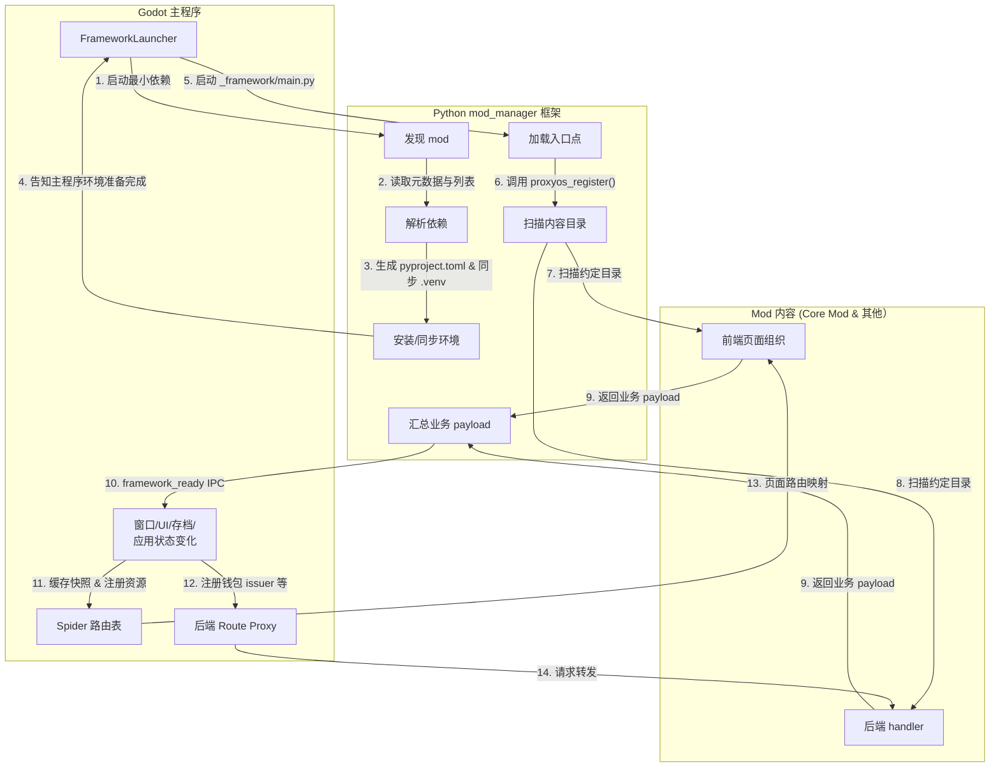
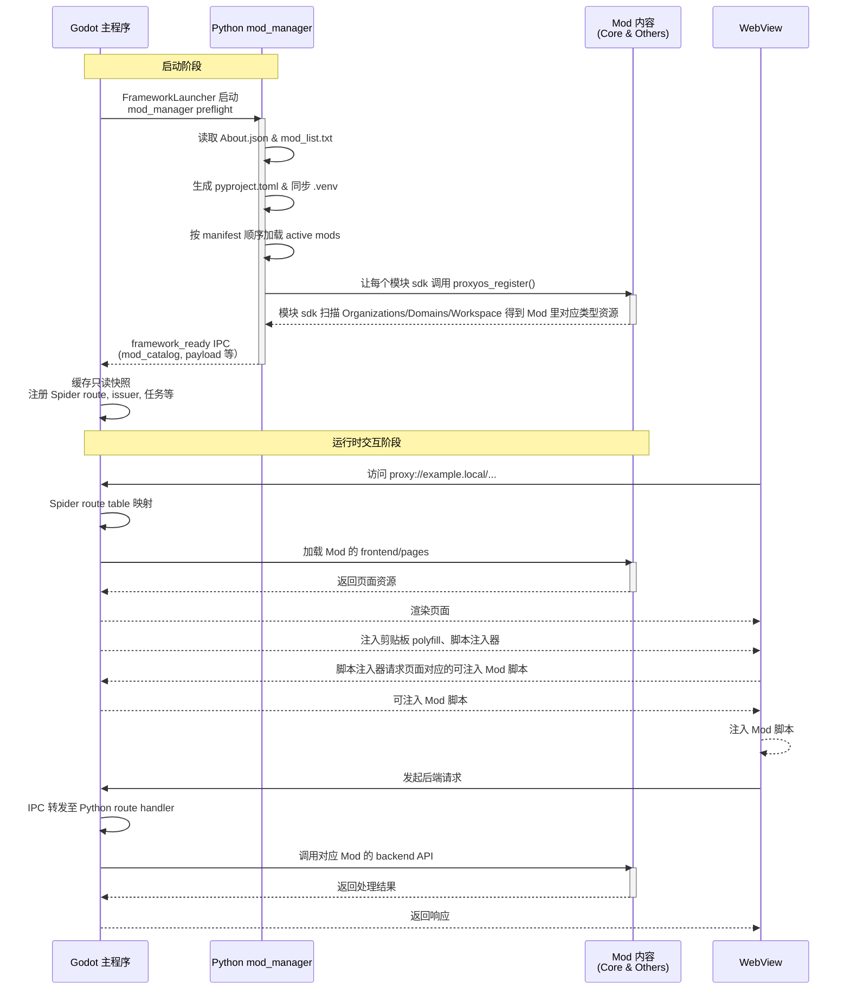

+++
date = '2026-07-05T17:27:00+08:00'
draft = false
title = 'Proxyos Mod 系统介绍'
slug = 'proxyos-mod'
series = ['proxyos-weekly']
categories = ['ProxyOS', 'DevLog']
tags = ['ProxyOS', '周报', '独立游戏开发', '技术日志']

+++

> TL;DR 概览
>
> 这是游戏中 Mod 系统的各种设计、决策、调整后得到的结果。你可以从中看到为什么这个游戏以 Mod 为核心、如何提供 Mod 能力、为什么以这种方式提供 Mod 能力等内容



# 本文定位——ProxyOS Mod 作者指南 (Lite)

实际上，这篇文章本质上是游戏内附带的 《ProxyOS Mod 作者指南》的子集，但不同于游戏内附带的那个随游戏开发而更新、聚焦于各个可用接口、具体可用 mod 能力、mod 实现思路的版本，这个版本聚焦于 Mod 系统的设计思想等更持久的内容

你可以把它当作全集版本的索引，也可以作为设计自己游戏 Mod 系统的参考……或者单纯将其视为这个游戏开发者在未来发现游戏暴死、根本没人做 Mod 前的乐观自言自语

# Mod 在本项目中的定位

游戏的 Godot 核心部分将所有教程之后还能用到的状态转移抽象成了 Action，而 Mod 可以自由使用剧本系统自动调用 Action，也可以在 Mod 脚本里调用这些 Action 完成所有需要的状态转移

因此完成了最开始的引入章节之后，玩家看到的一切内容都是由名为 Core 的 Mod 提供的（或者也可以说除了基础语言语法教程之外的游玩内容全由 Core Mod 提供）

## 为什么完全使用 Mod 做内容

### 浪漫点说

这个游戏本身的哲学就是如此。ProxyOS 的叙事核心是“代理”。玩家看到的系统、网页、聊天、任务和经济活动都不是某个单一程序直接裸露出的真相，而是一层层代理通过桥接、过滤、重渲染共同呈现的结果。

而 mod 系统把这个主题落到工程结构上：

- **内容可以被分布式提供**：一个域名、一组任务、一段网页或一个组织都可以由不同 mod 提供。
- **内容可以被覆盖**：通过 Base Mod+Extend Mod 的模式，Extend 可以自由覆盖、扩展 Base 的行为
- **Web 内容保持“站点”形态**：网页仍以 `proxy://<domain>/...` 被浏览，mod 作者可以像维护一个站点一样组织页面、API、脚本和数据。

在这个游戏里，mod 不是“附加 DLC 脚本”，而是 ProxyOS 世界观里的内容节点：它拥有自己的组织、域名、后端、页面、任务和叙事事件，再通过一套适配器带到玩家面前。

### 现实点说

我喜欢 Rimworld，喜欢它的 Mod 生态，喜欢它的生命力。

我知道认识到 Rimworld 的生命力绝非仅仅是它的 Mod 生态带来的，更重要的是它本身就有丰富的机制能给玩家带来各种涌现体验。

但我也清晰地认识到我的个人能力是有极限的，我可以构建这个世界的骨架，但我没有能力和 Caves of QUD 一样花上数年为其编纂所有内容，或者和 Rimworld 一样花上十年 EA。

至于解法，那就得看这个项目最初的概念了。这个项目也诞生于一个极端的时代节点：大量人鼓吹 vibe coding 但实际只是在堆屎山，AI 辅助编程被滥用到"不理解代码也能写代码"的程度。在这个背景下，ProxyOS 是一个被包装成游戏的 Python 教程，它用 meta 的方式展示 vibe 过度的后果（游戏世界里 ProxyOS 的过度封装和仿生逻辑就是这面镜子），同时在 AI 辅助编程已成常态的前提下，不着重教语法，而是教"编程"本身——什么是程序，为什么这些语法是这样设计的，为什么在那个场景下要用那个思路。

换言之，目标不是让玩家玩完后想"定义函数得用 def"，而是让玩家感受到"所以我需要在这个地方用函数"。语法只是副产物，核心是让玩家理解**编程作为一种思维方式**的本质：把问题拆解、给思路命名、让逻辑复用、用结构化的方式描述世界。

而这游戏的核心竞争力应该是"用类 Hacknet 的核心循环和演出，讲一个类 Owell 的故事，并在过程中让玩家使用类 Else Heart.Break() 的真实编程，即使毫无编程经验的玩家也能在无 AI 辅助的情况下完成这款游戏，并得到独立设计一个游戏项目的基础能力"

那么当玩家完成这款游戏时，我该怎么祝贺他们呢？

我的想法是，让他们可以换个视角，可以作为 Mod 作者来审视这款游戏，并通过十分简单的代码用自己的热情改变游戏里的世界——就像是编程本身一样，所有编程技术本质上都是将自己的思想化为逻辑，让带着自己思想的逻辑改变世界。

而且大言不惭地说，没准这个 mod 机制能让游戏更出圈呢？

> 梦话留到梦里说吧 .jpg

## Mod 系统的设计思想

其实设计思路已经在前文说了，那就是“Godot 管框架逻辑，Python 管内容逻辑”

ProxyOS mod 机制把 python 当作一个内容加载器使用：

- Godot 主程序负责启动 Python mod 框架
- Python mod 框架负责发现 mod、解析依赖、安装/同步环境、加载入口点、扫描内容目录、汇总业务 payload。
- Godot 主程序从 Python mod 框架接收所有内容资源、注册主程序侧资源，并执行窗口/UI/存档/应用状态变化。
- 内容资源中对标现实为 Python 侧提供能力
  - mod 可以自定义 api handler，并在网页中使用任意自己想使用的技术，把 mod 当 server 调
  - mod 可以自定义 Python 侧 Action，让游戏进行到某个阶段时自动调用 mod 的逻辑，把 mod 作为游戏逻辑的扩充
  - mod 可以要求主程序为其持久化数据，以此实现自己的数据维护

## 典型目录结构

一个 mod 通常长这样：

```text
Mods/
  mod_list.txt                  # 根目录加载顺序；缺失时框架会创建官方默认列表
  pyproject.toml                # 生成的 uv workspace，不要手写维护
  .venv/                        # 生成的 active mod 环境，不要提交

  MyMod/
    About/
      About.json                # mod_id、显示名、依赖
    pyproject.toml              # Python 包声明和 proxyos entry point
    my_mod/
      __init__.py               # 作者自己的可 import Python 包
      proxyos_entry.py          # 入口模块；通常只保留 no-op proxyos_register
      util/
        __init__.py
        trace_codec.py          # 同 mod 多个 Domain 或其他 mod 共享的 helper
    locale/
      en/LC_MESSAGES/*.po       # Python 后端 gettext 目录
    Workspace/
      bin/...
      dev_environment/...
      doc/...                   # 会按同样相对路径解锁到玩家工作目录

    Organizations/
      MyOrg/
        org.toml                # 组织、issuer、证书声明
        cert/*.pem

    Domains/
      example.local/
        domain.toml             # 域名归属：org = "MyOrg"
        frontend/
          pages/
            index.html          # proxy://example.local/index.html
          _overlay/<locale>/pages/
            ...                 # 生成的前端翻译 overlay，不手改
        backend/
          task/
            first_task/
              task.json
              req_submit.json
              validator/
                validator.json
                custom_validator.py
              archive/*.json
              desktop_pet/*.json
          story/
            intro.yaml
          shop/
            merchant.csv
            stock/items.csv
            shop_handler.py
            shop_hooks.py

      _/
        Injections/
          spider_utils/
            example_userscript.js  # 跨域 Spider 注入脚本；必须带 @id 和 @include
```

必备文件：

- `About/About.json`：mod 元数据。`mod_id` 是游戏内稳定 ID；`dependencies` 表达游戏内 mod 依赖关系。
- `pyproject.toml`：Python 包声明。`[project.entry-points.proxyos]` 必须声明且只声明一个入口点；运行时加载使用这里写出的 import path。
- `<mod_package>/`：作者自己的普通 Python 包。推荐包名与 `mod_id` 对齐；如果名字过短或容易冲突，使用更明确的包名。
- `domain.toml`：每个真实网页/后端域名都需要一个域目录和归属组织。

### Python 包与共享 util

`Domains/`、`Organizations/` 和入口模块是框架会主动扫描或导入的钩子点，不适合作为作者自由组织共享代码的根目录。跨 Domain 复用的普通 Python 代码放在 mod 自己导出的包里：

```python
from my_mod.util.trace_codec import decode_trace
from my_mod.util.signal_math import score_signal
```

同一个 active mod workspace 中，`mod_manager` 会把 active mod package 加进生成的 `Mods/pyproject.toml`，并用 uv 同步到 `Mods/.venv`。因此 handler 被扫描导入时，已经可以通过正常 Python import 找到 active mod package。被其他 mod import 的提供方也必须处于 active mod 列表中；未启用的 mod 不会作为 workspace member 安装。

跨 mod 复用时，依赖方需要同时声明游戏内依赖和 Python 包依赖：

```json
{
  "mod_id": "echo_story",
  "dependencies": ["echo_base"]
}
```

```toml
[project]
dependencies = ["proxyos-echo-base"]

[tool.uv.sources]
proxyos-echo-base = { workspace = true }
```

`About.json.dependencies` 表达 mod 加载/内容依赖关系；`pyproject.toml [project].dependencies` 表达 Python import 依赖；`pyproject.toml [project.entry-points.proxyos]` 表达唯一 Python 入口模块。三者用途不同，跨 mod import 需要 Python dependency。

根目录生成物：

- `Mods/mod_list.txt`：每行格式是 `<mod_id> @ <update_url> == <mod_version>`，顺序就是启用和加载顺序。
- `Mods/pyproject.toml` 与 `Mods/.venv/`：由 `mod_manager` 生成和同步，作者不应手动编辑。

## 加载与交互流程

启动时的顺序是：

1. Godot 的 `FrameworkLauncher` 启动最小依赖的 Python `mod_manager` preflight。
2. `mod_manager` 读取 `Mods/*/About/About.json`、每个 mod 的 `pyproject.toml` 和 `Mods/mod_list.txt`。
3. `mod_manager` 生成 `Mods/pyproject.toml`，同步 `Mods/.venv`，并写出 active manifest。
4. Godot 使用生成环境启动 `_framework/main.py`。
5. Python 按 manifest 顺序加载 active mods，调用无参数 `proxyos_register()`。
6. 框架组件扫描 `Organizations`、`Domains` 和 `Workspace` 下的约定目录。
7. Python 发送 `framework_ready`，里面包含 `mod_catalog`、`mod_states`、`active_mod_order`、workspace 文件映射和各业务 payload。
8. Godot 缓存只读快照，并注册钱包 issuer、后端 route proxy、Spider 页面路由、Workspace 文件映射、Pocket 任务、Archive 信息段、桌宠对话池、story 事件配置等。
9. WebView 加载 `proxy://<domain>/...` 时，Godot 用 Spider route table 映射到对应 mod 的 `frontend/pages`。
10. Web 页面或任务系统发起后端请求时，请求路径经 Godot IPC 转发到 Python route handler。

后加载 mod 可以在某些路由表上覆盖先加载的同 URL 前缀，也可以覆盖或者扩充某些剧本资源，以此实现 mod 之间的自定义。

Godot 和 Python `mod_manager` 彼此只通过 IPC 交流，而 Godot 不感知 Mod 的结构，以此保证双方耦合最小化，以后甚至可以直接升级 mod manager。

>Q：为什么不用 Godot 的 Mod Loader？
>
>A：因为我不想用啥库都没有的 Godot 写后端，推己及人我觉得 Mod 作者也不会想
>
>Q：为什么不使用类 Rimworld 的 Assembly+Def 架构？
>
>A：在 demo 阶段我想尽量区分内容（Python 侧主导）和游戏底层能力（Godot 侧主导），如果允许通过类似 Assemble 的方式加载 gdscript，开发负担会超出我的控制。而且这个游戏不同于以增加“实例”为主要扩展方式的 Rimworld，游戏内各个网站的后端都可能有自己独有的“逻辑”，因此这个游戏需要以“逻辑（也就是 Python 侧的 api handler）”为首要考量设计 Mod 架构，而非以“实例（承载具体类型具体数据的 Def）”为主

### 整体内容加载架构



> Q：为什么让 Python 侧搞 mod manager，这个不应该是游戏核心机制吗？
>
> A：确实可以说是核心机制的一部分，但实际上这个部分本质上是 Godot 侧和 Python 侧的交界处，划分并不那么绝对。而用 Python 更好处理依赖解析和环境同步，启动各模块的 python 侧 sdk 扫描其需要的资源也更方便，所以我使用 Python 侧做了 mod manager

### 具体页面数据流



> Q：为什么 WebView 显示一个页面需要来回乒乓？直接在启动页面时注入脚本不就可以了吗？
>
> A：我最开始也是这么考虑的，但是 godot-wry 的页面自动注入机制是 WebView 实例级配置，无法满足按页面按照依赖关系依次注入指定的几个脚本的需求。而直接 eval 又比较难以调试和扩展，所以我干脆把注入逻辑也做到了 js 脚本里，这样以后有大佬有更好方案的话，他们还可以直接在 mod 里覆盖这个脚本，以此提供更好的体验。退一步说，这每页加载时的额外一次交互应该性能影响可控

# Mod 作者自由度边界

舒适区：

- 新增域名页面与 API。
- 新增任务、远程验证、奖励、聊天反馈。
- 新增 story YAML 事件和轻量自定义 handler。
- 新增信息段、桌宠台词、通知、商店、issuer、库存。
- 覆盖或扩展某个站点路径，只要通过 `Domains/<domain>/frontend/pages` 和加载顺序完成。

可以做但要小心：

- 长状态机、复杂经济系统、跨多个域名共享状态。
- 多 mod 覆盖同一路由或同一 URL 前缀。
- 自定义 story condition/action handler。
- 依赖第三方 Python 包；它们会影响 `Mods/.venv` 同步和启动失败率。

不舒适，通常不建议：

- 改变游戏核心循环
- 新增非网页 UI

不过我也有在规划使用 [`ProjectSettings.load_resource_pack()`](https://docs.godotengine.org/en/stable/tutorials/export/exporting_pcks.html) 的机制来提供给 Mod 作者添加游戏内非网页 UI 的能力。不过在 demo 流行或者暴死前我暂时还没有做这个的计划。

# 手把手：写一个完整的小 Mod

下面示例创建 `EchoTrace`，它提供一个网页、一个任务、一个后端验证 route、一个故事事件，以及可选的奖励反馈。

## 1. 创建元数据

这部分用于声明一个 mod 的摘要信息、依赖关系等等

```text
Mods/EchoTrace/
  About/About.json
  pyproject.toml
  echo_trace/
    __init__.py
    proxyos_entry.py
    util/__init__.py
```

`About/About.json`：

```json
{
  "mod_id": "echo_trace",
  "display_name": "Echo Trace",
  "dependencies": []
}
```

`pyproject.toml`：

```toml
[build-system]
requires = ["setuptools>=68.0"]
build-backend = "setuptools.build_meta"

[project]
name = "proxyos-echo-trace"
version = "0.1.0"
description = "A small ProxyOS content mod"
requires-python = ">=3.12"
dependencies = []

[project.entry-points.proxyos]
echo_trace = "echo_trace.proxyos_entry"

[tool.setuptools.packages.find]
include = ["echo_trace*"]
```

`echo_trace/proxyos_entry.py`：

```python
from proxy_os_ipc._framework.hookspecs import hookimpl

@hookimpl
def proxyos_register():
    pass
```

保持 `proxyos_register()` 无参数。通常扫描器会自动发现你的目录内容，不需要在这里塞全局注册逻辑。
每个 mod 的 `[project.entry-points.proxyos]` 只能有一个条目；条目名是 packaging metadata，运行时使用右侧的 import path。

## 2. 创建组织和域名

`Organizations`主要承担跨网页的数据，比如一个组织发行的代币数据之类的。目前在这个 Mod 里没啥作用，但以后游戏内可能会提供根据`Organizations`整理网页等数据的功能，所以目前还是得加个配置来指定每个域名的组织归属。

```text
Mods/EchoTrace/
  Organizations/EchoLab/org.toml
  Domains/echo.trace.local/domain.toml
```

`Organizations/EchoLab/org.toml`：

```toml
display_name = "Echo Lab"
```

`Domains/echo.trace.local/domain.toml`：

```toml
org = "EchoLab"
```

## 3. 添加网页

这就是玩家可以在游戏里看到的页面，玩家可以使用`proxy://echo.trace.local/frontend/pages/`这样的 url 访问`Domains/echo.trace.local/frontend/pages/index.html`，

其中可以使用相对路径引用`./js/foobar.js`之类的脚本或样式，但这里没用到

需要注意这里当玩家点击`<button id="issue">接收任务</button>`时，就会调用后端的`proxy://echo.trace.local/api/trace/issue`接口，这个接口的实现我们后面会提

`Domains/echo.trace.local/frontend/pages/index.html`

```html
<!doctype html>
<html lang="zh-Hans">
<head>
  <meta charset="utf-8">
  <title>Echo Trace</title>
</head>
<body>
  <main>
    <h1>Echo Trace</h1>
    <p>记录码：ECHO-042</p>
    <button id="issue">接收任务</button>
    <pre id="out"></pre>
  </main>
  <script>
    document.getElementById('issue').addEventListener('click', async () => {
      const res = await fetch('proxy://echo.trace.local/api/trace/issue')
      document.getElementById('out').textContent = await res.text()
    })
  </script>
</body>
</html>
```

## 4. 添加任务

这是玩家的任务系统可以显示的任务。当`dependency_tasks`里的任务都被完成时，这个任务就可以被发放了。任务的发放需要由网页、剧本系统等其他模块触发，这样就不是”玩家完成任务后，第二天一醒发现冒出了野生的新任务“，而是”玩家完成任务后，阅读了某些网页、聊天信息，触发了新任务“

需要注意这里当玩家将文件拖入“提交记录码”时，就会调用后端的`proxy://echo.trace.local/api/trace/validate`接口，这个接口的实现我们后面会提

`Domains/echo.trace.local/backend/task/first_trace/task.json`：

```json
{
  "task_id": "[echo_trace]_[echolab]_first_trace",
  "name": "追踪第一段回声",
  "description": "在 Echo Trace 页面中找到记录码，并提交给后端。",
  "goal": "提交正确的记录码。",
  "dependency_tasks": [],
  "is_hidden": false,
  "deadline_cycles": -1,
  "is_critical": false,
  "min_completed_requirements": 0,
  "requirements": [
    {
      "script_inheritance": "RemoteRequestRequirement",
      "req_id": "submit",
      "name": "提交记录码",
      "url": "proxy://echo.trace.local/api/trace/validate",
      "optional": false
    }
  ]
}
```

`Domains/echo.trace.local/backend/task/first_trace/req_submit.json`：

```json
{
  "req_id": "submit",
  "validation": {
    "code": "ECHO-042"
  },
  "success_message": "记录码已确认。"
}
```

## 5. 添加后端 route

这里就是之前说过会提的两个接口的后端实现了，如下是标准实现模式，但也可以使用更自由的方式

比如玩家点击页面按钮时调用的`proxy://echo.trace.local/api/trace/issue` ，除了发放任务也可以做一些诸如“给玩家解锁新道具”、“启动一个定时发送消息的定时器”、“解锁任务相关文件”等等操作

又比如玩家提交文件时调用的`proxy://echo.trace.local/api/trace/validate`，除了这个典型的使用`req_submit`来定义验证配置，并使用内置的`validate_remote_request`来结合验证条件进行验证外，也可以自行定义自己的验证器和验证配置，来实现更复杂的验证

`Domains/echo.trace.local/backend/task/task_handler.py`

```python
from proxy_os_ipc.cpg.server.route import Request, route
from proxy_os_ipc.sdk.notification import NotificationType, notification
from proxy_os_ipc.sdk.pocket import activate_and_issue_task, validate_remote_request

TASK_ID = "[echo_trace]_[echolab]_first_trace"
REQ_ID = "submit"

@route.register_route("echo.trace.local/api/trace/issue", "GET")
async def issue_trace_task(request: Request) -> dict:
    issued = await activate_and_issue_task(TASK_ID)
    return issued.to_response()

@route.register_route("echo.trace.local/api/trace/validate", "POST")
async def validate_trace_submission(request: Request) -> dict:
    result = await validate_remote_request(request, TASK_ID, REQ_ID)
    if result.is_ok:
        await notification.show(
            "Echo Trace",
            "第一段回声已确认。",
            notification_type=NotificationType.INFO,
            notification_id="echo_trace_first_trace_done",
        )
    return result.to_response()
```

## 6. 可选：添加 story YAML

除了使用网页触发任务、使用任务的 validate 接口 handler 调 sdk 实现任务完成后效之外，也可以使用剧本系统

如下就是一个“进入 FORMAL 章节时发放任务，并在任务完成后设置标记”的最小示例

> 阶段数字来自 `GameStage.Stage`：`INTRO=-1`、`PROLOGUE=0`、`RECOVERY=1`、`FORMAL=2`。当前 YAML 编译器要求 `stage_entered` 写数字。

不过在真正写剧本系统的时候，强烈建议不要用`stage_entered`，因为-1、0、1 三个 Stage 基本是教程阶段，Stage 2 就是整个游戏的内容，所以一般只有 Core（游戏自身内容）会将 Stage 作为触发条件。这也是为什么我没有对其提供枚举别名——它本就不该被常规 mod 使用

`Domains/echo.trace.local/backend/story/first_trace.yaml`

```yaml
meta:
  id: first_trace
  name: Echo Trace 起点

events:
  - id: issue_when_formal
    name: 正式阶段签发任务
    on:
      stage_entered: 2
    do:
      - activate_and_issue_task: "[echo_trace]_[echolab]_first_trace"

  - id: mark_done
    name: 完成后写入故事标记
    after: issue_when_formal
    on:
      task_completed: "[echo_trace]_[echolab]_first_trace"
    do:
      - set_flag: first_trace_done
```

## 7. 可选：添加信息段或桌宠反馈

信息段其实是早期开发时仿 Owell 的机制，但后来随着项目的定位越来越明确（让玩家在玩中学编程思想），重心也从信息段转移到了`RemoteRequestRequirement`等可以进行复杂验证的模式，只有在添加网页浏览解谜类的任务是才会用到这个了

而桌宠对话池并非必要内容，而且目前设计可能还不稳定（比如使用内部编辑器展示示例调试代码的功能还没想好要不要迁移为 mod 实现），所以暂时不推荐 mod 添加

信息段：`Domains/echo.trace.local/backend/task/first_trace/archive/trace_note.json`

桌宠对话池：`Domains/echo.trace.local/backend/task/first_trace/desktop_pet/trace_hint.json`

这些 JSON 的字段应参考对应 SDK/Godot Resource 字段；如果 `Mods/Core` 中没有同类示例，就回到扫描器和 Resource 定义核对。不要为它们创建新的加载入口。

## 8. 启用和验证

1. 在 `Mods/mod_list.txt` 中加入：

```text
echo_trace @ local == 0.1.0
```

2. 检查这些点：

- `About/About.json` 的 `mod_id` 与 `Mods/mod_list.txt` 一致。
- `pyproject.toml` 的 `[project].version` 与 `Mods/mod_list.txt` 一致。
- route handler 位于框架会扫描的约定路径。
- `task.json` 有稳定 `task_id`，requirement 的 `url` 指向已注册 route。
- story YAML 的 event id 在文件内唯一。
- 页面和脚本使用 `proxy://echo.trace.local/...`，不是本地绝对路径。

3. 验证方式以窄检查为主：

- 用 Python 解析 JSON/TOML/YAML。
- 让 Python 编译 route 文件或运行 AST 检查。
- 检查 `Mods/Core` 中同类示例，确认目录位置一致。
- 不启动 headless Godot；agent 环境下用静态检查和启动日志定位问题。