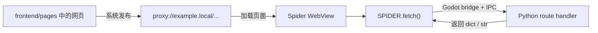
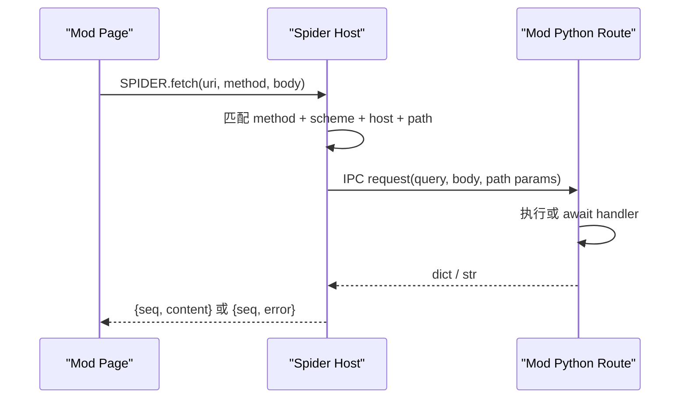

+++
date = '2026-07-19T19:02:00+08:00'
draft = false
title = 'Proxyos 浏览器系统介绍'
slug = 'proxyos-spider'
series = ['proxyos-weekly']
categories = ['ProxyOS', 'DevLog']
tags = ['ProxyOS', '周报', '独立游戏开发', '技术日志']

+++

> TL;DR 概览
>
> ChatGPT-5.6-Sol 写的



# Spider 网页与 Route 作者指南

这份文档面向 mod 作者。

你只需要关心两件事：

1. **Page 是站点文件**：把 HTML、CSS、JavaScript 和图片放进 `frontend/pages`，系统把它们发布成 `proxy://` 网页。
2. **Route 是 Python 后端**：用 decorator 注册 URL 和 HTTP method，网页通过 `SPIDER.fetch()` 调用它。

系统负责扫描、注册、跨 mod 路由、当前语言文件选择、WebView 加载和 Python IPC。你负责提供正确的目录、URL、handler 和返回值。

---

## 一、最短心智模型

一个 Spider 站点通常长这样：

```text
MyMod/
  my_mod/
    proxyos_entry.py
    domains/
      example_local/
        routes.py

  Domains/
    example.local/
      domain.yaml
      frontend/
        pages/
          index.html
          style.css
          app.js
          api-demo/
            index.html
```

公开地址是：

```text
proxy://example.local/index.html
proxy://example.local/style.css
proxy://example.local/app.js
proxy://example.local/api-demo/index.html
```

网页调用后端：

```javascript
const response = await SPIDER.fetch("proxy://example.local/api/status")
const status = JSON.parse(response.content)
```

Python 提供后端：

```python
from proxyos_core.cpg.server.route import Request, route


@route.register_route("example.local/api/status", "GET")
def status(_request: Request) -> dict:
    return {"online": True}
```

完整数据流是：



---

## 二、Page 机制

### 2.1 Page 是什么

Page 是 `Domains/<domain>/frontend/pages/` 下的普通网页文件。

例如：

```text
Domains/example.local/frontend/pages/
  index.html
  style.css
  app.js
  images/
    logo.png
  forum/
    index.html
    thread.html
```

对应公开 URL：

| 文件 | 公开 URL |
| --- | --- |
| `pages/index.html` | `proxy://example.local/index.html` |
| `pages/style.css` | `proxy://example.local/style.css` |
| `pages/images/logo.png` | `proxy://example.local/images/logo.png` |
| `pages/forum/index.html` | `proxy://example.local/forum/index.html` |
| `pages/forum/thread.html` | `proxy://example.local/forum/thread.html` |

`domain.yaml` 声明该 domain 属于哪个组织：

```yaml
org: ExampleOrg
```

目录名就是公开 host：

```text
Domains/example.local/
→ proxy://example.local/
```

### 2.2 Page 如何被注册

游戏启动时，Python framework 扫描所有 active mod 的 `frontend/pages`。

系统为页面根目录和每个子目录建立 URL 前缀。例如：

```text
frontend/pages/
frontend/pages/forum/
frontend/pages/forum/posts/
```

形成：

```text
proxy://example.local/
proxy://example.local/forum/
proxy://example.local/forum/posts/
```

前缀保存的是目录归属，因此目录中的所有文件都能通过同一公开路径访问。

### 2.3 Page 如何被加载

页面加载分成三层：

```text
公开地址：
proxy://example.local/forum/index.html

稳定网页地址：
res://proxied.from.unknown.architecture/example.local/forum/index.html

真实 mod 文件：
res://Mods/MyMod/Domains/example.local/frontend/pages/forum/index.html
```

mod 作者只使用第一层：

```text
proxy://example.local/...
```

中间的稳定网页地址让 WebView 获得固定的站点目录。

真实文件地址让系统找到当前提供该目录的 mod。

### 2.4 相对路径如何工作

HTML 可以使用普通相对路径：

```html
<!doctype html>
<html>
<head>
  <link rel="stylesheet" href="./style.css">
</head>
<body>
  
  <script src="./app.js"></script>
</body>
</html>
```

如果页面地址是：

```text
proxy://example.local/forum/index.html
```

浏览器会把相对资源理解成：

```text
proxy://example.local/forum/style.css
proxy://example.local/forum/images/logo.png
proxy://example.local/forum/app.js
```

实际运行时，WebView 在稳定虚拟站点下计算这些相对 URL，再由系统映射到真实 mod 文件。

因此推荐：

- 同目录资源使用 `./file`；
- 上级目录资源使用 `../file`；
- 站点内固定地址使用 `proxy://<domain>/path`；
- 页面链接尽量写完整 HTML 文件名，例如 `./thread.html` 或 `proxy://example.local/forum/index.html`。

### 2.5 页面导航如何工作

普通 anchor 可以写：

```html
<a href="./thread.html">打开帖子</a>
<a href="proxy://example.local/account/index.html">账户</a>
```

Spider 的导航脚本会接住这些站点链接，把目标 URL 交回当前浏览器窗口，再由同一套 Page/Route 规则加载。

数据流是：

```text
用户点击 <a>
→ 浏览器算出目标公开 URL
→ Spider 把 navigation request 交给 Godot
→ 当前窗口重新加载目标 URL
→ 先检查 GET Route
→ 再加载静态 Page
```

这套宿主导航主要服务 anchor click。使用 `window.location`、form submit 或其他程序化导航时，应按普通 WebView 行为测试。

### 2.6 404 如何工作

站点可以提供：

```text
frontend/pages/404.html
```

浏览器加载某个不存在的静态页面时，调用方可以把该站点的 `404.html` 作为 fallback。

推荐每个会被玩家直接浏览的 domain 都提供一份 404 页面。

---

## 三、页面语言 overlay

### 3.1 overlay 是当前语言版本的页面文件

页面 overlay 位于：

```text
Domains/<domain>/frontend/_overlay/<locale>/pages/
```

例如：

```text
frontend/pages/forum/index.html
frontend/_overlay/en/pages/forum/index.html
frontend/_overlay/ja/pages/forum/index.html
```

三个文件共享公开 URL：

```text
proxy://example.local/forum/index.html
```

当前语言为 `en` 时，系统加载英文 overlay。

当前语言为 `ja` 时，系统加载日文 overlay。

当前语言没有对应 overlay 时，系统加载 base 页面。

### 3.2 locale fallback

系统按以下顺序选择：

```text
完整 locale
→ language
→ base
```

例如：

```text
zh_CN
→ zh
→ frontend/pages 中的 base
```

### 3.3 overlay 的文件规则

每个 overlay 文件都对应一个 base 文件。

例如存在：

```text
frontend/_overlay/en/pages/forum/index.html
```

同时需要存在：

```text
frontend/pages/forum/index.html
```

页面翻译流水线负责生成 `frontend/_overlay/<locale>/pages`。把 base 页面作为源内容维护，把 overlay 当作生成结果。

### 3.4 overlay 与其他资源

overlay 可以只替换 HTML：

```text
英文 index.html → frontend/_overlay/en/pages/forum/index.html
style.css       → frontend/pages/forum/style.css
app.js          → frontend/pages/forum/app.js
```

英文 HTML 中的 `./style.css` 和 `./app.js` 会继续落到同一公开目录的 base 资源。

如果 CSS 或 JavaScript 也需要语言版本，翻译流水线可以为对应文件生成同相对路径 overlay。

---

## 四、跨 mod Page 路由

### 4.1 最长前缀决定目录归属

多个 active mod 可以向同一个 domain 提供页面目录。

假设最终路由中有：

```text
proxy://example.local/          → mod A
proxy://example.local/forum/    → mod B
proxy://example.local/forum/x/  → mod A
```

访问结果是：

| URL | 提供者 |
| --- | --- |
| `proxy://example.local/index.html` | mod A |
| `proxy://example.local/forum/index.html` | mod B |
| `proxy://example.local/forum/x/index.html` | mod A |

系统总是选择覆盖目标 URL 的最长目录前缀。

### 4.2 相同前缀由加载顺序决定

两个 mod 声明相同目录前缀时，active-mod 顺序中后出现的 mod 取得该前缀。

例如：

```text
mod A 声明 proxy://example.local/forum/
mod B 随后声明 proxy://example.local/forum/
```

最终 owner 是 mod B。

作者应在 mod 依赖和兼容说明中写明这类覆盖关系。

### 4.3 共享 domain 的当前注意事项

每个拥有 `frontend/pages` 的 mod 都会声明 domain 根：

```text
proxy://example.local/
```

所以 mod B 即使只新增：

```text
frontend/pages/forum/index.html
```

它的 pages 根仍会参与：

```text
proxy://example.local/
```

的竞争。

当前最稳妥的 authoring 方式是：

- 一个 domain 由一个 mod 作为主要页面 owner；
- 扩展 mod 共享 domain 时，明确依赖和加载顺序；
- 覆盖前检查 domain 根页面与 404 页面；
- 需要完全独立的站点时使用新的 domain。

---

## 五、Route 机制

### 5.1 Route 是什么

Route 是：

```text
HTTP method + proxy URL path
→ Python handler
```

例如：

```text
GET proxy://example.local/api/status
→ status()
```

Route 适合：

- 页面状态查询；
- 搜索、列表和详情 API；
- 谜题答案验证；
- Pocket 任务签发和远程提交；
- CPG 商店购买与支付通知；
- 动态生成一页 HTML；
- 通过 SDK 请求 Godot 执行任务、聊天、通知和 Archive 等效果。

### 5.2 Route 放在哪里

Route 是可信 Python 包的一部分，通常放在：

```text
MyMod/
  my_mod/
    proxyos_entry.py
    domains/
      example_local/
        __init__.py
        routes.py
```

`Domains/` 是内容树。

`my_mod/` 是可执行 Python 包。

在 mod entry 中显式导入 route 模块，让 decorator 完成注册：

```python
# my_mod/proxyos_entry.py

def proxyos_register() -> None:
    from my_mod.domains.example_local import routes
```

也可以由 domain 包提供清晰的注册入口：

```python
# my_mod/domains/example_local/__init__.py

def register_backend() -> None:
    from . import routes
# my_mod/proxyos_entry.py

from my_mod.domains.example_local import register_backend


def proxyos_register() -> None:
    register_backend()
```

### 5.3 注册 GET Route

```python
from proxyos_core.cpg.server.route import Request, route


@route.register_route("example.local/api/status", "GET")
def status(_request: Request) -> dict:
    return {
        "service": "example",
        "online": True,
    }
```

省略 scheme 时默认使用 `proxy`：

```text
example.local/api/status
```

等价于：

```text
proxy://example.local/api/status
```

### 5.4 path 参数

路径段支持 `{param}`：

```python
@route.register_route("example.local/api/items/{sku}", "GET")
def get_item(request: Request) -> dict:
    sku = request.path_params["sku"]
    return {"sku": sku}
```

请求：

```text
proxy://example.local/api/items/ECHO-42
```

得到：

```text
request.path_params["sku"] == "ECHO-42"
```

一个 `{param}` 对应一个非空路径段。

### 5.5 query 参数

页面请求：

```text
proxy://example.local/api/search?q=echo&page=2
```

handler：

```python
@route.register_route("example.local/api/search", "GET")
def search(request: Request) -> dict:
    query = request.query.get("q", "")
    page = int(request.query.get("page", "1"))
    return {
        "query": query,
        "page": page,
        "results": [],
    }
```

### 5.6 POST body

```python
@route.register_route("example.local/api/check", "POST")
def check(request: Request) -> dict:
    body = request.json_body()
    if body.is_err:
        return {"ok": False, "error": "INVALID_JSON"}

    answer = body.unwrap().get("answer", "")
    return {"ok": answer == "ECHO-42"}
```

具体业务已经有 SDK result helper 时，优先使用 helper 的 `.to_response()`。

例如 Pocket 远程验证：

```python
from proxyos_core.sdk.pocket import validate_remote_request


@route.register_route("example.local/api/task/validate", "POST")
async def validate(request: Request) -> dict:
    result = await validate_remote_request(
        request,
        "[my_mod]_[example]_task",
        "submit",
    )
    return result.to_response()
```

### 5.7 Route 的返回值

普通 API 返回 `dict`：

```python
return {"ok": True, "value": 42}
```

网页收到的 `response.content` 是 JSON 字符串：

```javascript
const response = await SPIDER.fetch("proxy://example.local/api/value")
const data = JSON.parse(response.content)
```

顶层带 `error` key 的 dict 表示请求失败：

```python
return {"error": "INVALID_REQUEST"}
```

`SPIDER.fetch()` 会把它变成 Promise rejection。普通业务结果推荐使用：

```python
return {"ok": False, "message": "The answer is incorrect."}
```

这样网页仍能从正常 response 中读取业务状态。

文本 API 可以返回 `str`：

```python
return "hello"
```

网页直接读取：

```javascript
const response = await SPIDER.fetch("proxy://example.local/api/hello")
console.log(response.content)
```

---

## 六、网页如何调用 Route

### 6.1 GET shorthand

GET 请求使用 URI shorthand：

```javascript
try {
  const response = await SPIDER.fetch(
    "proxy://example.local/api/status"
  )
  const data = JSON.parse(response.content)
  console.log(data.online)
} catch (error) {
  console.error(error)
}
```

URI shorthand 的含义固定为：

```text
method = GET
body = null
```

### 6.2 POST 请求

POST 使用完整 fetch payload：

```javascript
const response = await SPIDER.fetch("proxy.network.fetch", {
  uri: "proxy://example.local/api/check",
  method: "POST",
  body: {
    answer: "ECHO-42"
  }
})

const result = JSON.parse(response.content)
```

把对象作为 URI shorthand 的第二个参数不会形成 POST。method 和 body 需要放进 `proxy.network.fetch` payload。

### 6.3 fetch 数据流



系统在 framework ready 时已经收到 Route 清单，所以网页请求到达时可以直接匹配对应 handler。

Python handler 执行时再次匹配真实 callable，并构造完整 `Request`。

宿主返回 error 时，`SPIDER.fetch()` 的 Promise 会 reject；页面使用 `try/catch` 处理。

### 6.4 API Route 与静态文件 fallback

GET fetch 的查找顺序是：

```text
已注册 Python Route
→ 已注册 Godot 原生虚拟 API
→ 静态文本文件
```

POST、PUT、DELETE 等请求需要对应 Route 或原生虚拟 API。

静态 fallback 适合读取：

```text
JSON
纯文本
网页模板
其他文本资源
```

---

## 七、Route 如何动态覆盖 Page

### 7.1 GET Page Route 优先于同 URL 的静态文件

假设存在静态页面：

```text
Domains/example.local/frontend/pages/account/index.html
```

公开 URL：

```text
proxy://example.local/account/index.html
```

再注册：

```python
@route.register_route(
    "example.local/account/index.html",
    "GET",
)
def account_page(request: Request) -> str:
    username = request.query.get("user", "anonymous")
    return f"""<!doctype html>
<html>
  <body>
    <h1>Hello, {username}</h1>
  </body>
</html>
"""
```

访问该 URL 时，系统先调用 GET Route，并把返回的 HTML String 直接交给当前 WebView。

这让 mod 可以根据：

- 当前任务状态；
- query；
- 玩家选择；
- 后端数据；
- 临时剧情条件；

动态生成整页内容。

### 7.2 动态 Page 的返回契约

动态 Page Route 返回 HTML `str`：

```python
return "<!doctype html><html>...</html>"
```

普通 API 返回 `dict`：

```python
return {"ok": True}
```

系统用返回类型区分“整页 HTML”和“API 数据”。

### 7.3 动态 Page 的错误行为

URL 已命中动态 GET Route 后，该 Route 就拥有这次加载。

以下情况会结束本次加载：

- handler 抛出错误；
- IPC 超时；
- handler 返回非 String；
- Python framework 当前不可用。

系统不会在这些错误后自动显示同 URL 的静态文件。这样可以避免动态页面错误被静态页面悄悄掩盖。

### 7.4 动态 Page 的相对资源

静态 Page 从稳定站点 URL 加载，所以 `./style.css` 拥有明确目录。

动态 Page 使用 HTML String 加载，当前接口没有同时传入原 `proxy://` URL 作为 base。

因此动态 Page 推荐：

- 使用完整 `proxy://` 资源 URL；
- 或在 HTML 中使用明确的 `<base>`；
- 或把复杂 UI 放进静态 Page，仅用 Route 返回数据。

最后一种通常最简单：

```text
静态 HTML/CSS/JS
+
SPIDER.fetch() 动态数据
```

---

## 八、系统如何保证内容被正确调用

### 8.1 启动时先完成注册

页面和 Route 都在 framework ready 阶段完成扫描与注册。

WebView 开始正常加载 mod 页面时，系统已经拥有：

- active mod 顺序；
- 页面目录 owner；
- 页面语言 overlay；
- Python Route 清单；
- 注入脚本清单。

### 8.2 页面使用稳定公开 URL

mod 作者始终引用：

```text
proxy://<domain>/...
```

系统内部负责把它转成当前 owner 的真实文件。

页面链接和业务数据无需保存 `res://Mods/<mod_id>/...`。

### 8.3 静态资源保持同一站点目录

页面、CSS、JavaScript 和图片都先进入稳定虚拟站点。

相对 URL 在这个站点下解析，再落到真实 mod 文件。

这保证跨 mod 前缀组合后，网页仍然按公开 URL 结构工作。

### 8.4 当前语言在页面加载前选定

系统从扫描结果中选择：

```text
exact locale
→ language
→ base
```

语言切换后，已打开的 WebView 会收到更新后的资源路由表。

### 8.5 Route 使用 method 和完整路径身份

Route 清单包含：

```text
scheme
host
path
method
```

GET 和 POST 可以注册在同一路径：

```python
@route.register_route("example.local/api/item", "GET")
def read_item(request: Request) -> dict:
    ...


@route.register_route("example.local/api/item", "POST")
def update_item(request: Request) -> dict:
    ...
```

### 8.6 Python channel 始终取当前连接

每次 backend 请求都会使用当前 framework IPC channel。

framework 重连后，新请求走新 channel。

断连期间，请求返回 backend unavailable，而不是调用已经失效的连接。

### 8.7 当前窗口拥有自己的导航回路

导航消息携带目标 URL，并由发出消息的 Spider 窗口继续加载。

多个 WebView 同时存在时，一个页面的 anchor navigation 会回到它自己的浏览器回路。

---

## 九、userscript 与 Page 的关系

### 9.1 global script

以下目录中的脚本是每页基础设施：

```text
Domains/_/Injections/Global/
```

系统会在页面完成加载后自动注入它们。

Core 在这里提供：

- `SPIDER.fetch()`；
- protocol navigation；
- clipboard；
- JSON store；
- userscript injector。

普通 mod 通常直接使用这些能力。

### 9.2 普通 userscript

跨页面扩展脚本放在：

```text
Domains/_/Injections/
```

Global 目录之外的脚本使用 userscript metadata：

```javascript
// ==UserScript==
// @id [my_mod]_[example]_page_helper
// @include /^proxy:\/\/example\.local\/.*$/
// ==/UserScript==

document.documentElement.dataset.exampleHelper = "enabled"
```

系统在页面完成后：

```text
取得当前 proxy URL
→ 匹配 @include
→ 读取匹配脚本
→ 注入当前页面
```

userscript 适合：

- 多页共享 UI；
- 页面提示；
- DOM 增强；
- 跨站点监听。

站点自身的主逻辑仍推荐放在 `frontend/pages` 的普通 JavaScript 中。

### 9.3 当前完整浏览器应用注意事项

当前单页 Spider 窗口能完成普通 userscript 的匹配和注入。

当前完整浏览器应用会注入 global scripts，但普通 `@include` userscript 的 document-complete dispatch 链尚未闭合。

需要依赖普通 userscript 的 mod，应在目标宿主窗口中实际验证。站点关键功能放在页面自己的 JavaScript 中最稳妥。

---

## 十、常见设计选择

| 需求 | 推荐实现 |
| --- | --- |
| 纯展示页面 | 静态 Page |
| 带交互的站点 | 静态 HTML/CSS/JS + Route API |
| 谜题验证 | 静态 Page + POST Route |
| 当前玩家状态 | Page 启动后 GET Route |
| 动态列表/搜索 | Page + query Route |
| 完全动态的一页 HTML | 精确 GET Page Route 返回 `str` |
| 多页共享提示 | userscript |
| 长期业务状态 | Python SDK / JsonStore / Pocket /钱包等正式系统 |
| 页面临时 UI 状态 | 页面 JavaScript 内存或 DOM |
| 新增独立站点 | 新 domain |
| 扩展其他 mod 站点 | 明确依赖、加载顺序和根路径覆盖 |

---

## 十一、一个完整的 Page + Route 示例

### 11.1 目录

```text
Mods/EchoBoard/
  About/
    About.json
  pyproject.toml

  echo_board/
    __init__.py
    proxyos_entry.py
    domains/
      __init__.py
      echo_board_local/
        __init__.py
        routes.py

  Organizations/
    EchoBoard/
      org.yaml

  Domains/
    echo.board.local/
      domain.yaml
      frontend/
        pages/
          index.html
          style.css
          app.js
```

### 11.2 entry

```python
# echo_board/proxyos_entry.py

from echo_board.domains.echo_board_local import register_backend


def proxyos_register() -> None:
    register_backend()
# echo_board/domains/echo_board_local/__init__.py

def register_backend() -> None:
    from . import routes
```

### 11.3 Route

```python
# echo_board/domains/echo_board_local/routes.py

from proxyos_core.cpg.server.route import Request, route


POSTS = [
    {"id": "first", "title": "First Echo"},
    {"id": "second", "title": "Second Echo"},
]


@route.register_route("echo.board.local/api/posts", "GET")
def list_posts(request: Request) -> dict:
    query = request.query.get("q", "").lower()
    posts = [
        post
        for post in POSTS
        if query in post["title"].lower()
    ]
    return {"posts": posts}


@route.register_route("echo.board.local/api/posts/{post_id}", "GET")
def get_post(request: Request) -> dict:
    post_id = request.path_params["post_id"]
    for post in POSTS:
        if post["id"] == post_id:
            return {"found": True, "post": post}
    return {"found": False}
```

### 11.4 Page

```html
<!doctype html>
<html lang="zh-Hans">
<head>
  <meta charset="utf-8">
  <title>Echo Board</title>
  <link rel="stylesheet" href="./style.css">
</head>
<body>
  <main>
    <h1>Echo Board</h1>
    <input id="query" placeholder="Search">
    <button id="search">Search</button>
    <ul id="posts"></ul>
  </main>
  <script src="./app.js"></script>
</body>
</html>
```

### 11.5 JavaScript

```javascript
const queryInput = document.querySelector("#query")
const searchButton = document.querySelector("#search")
const posts = document.querySelector("#posts")

async function loadPosts() {
  const q = encodeURIComponent(queryInput.value)
  try {
    const response = await SPIDER.fetch(
      `proxy://echo.board.local/api/posts?q=${q}`
    )
    const data = JSON.parse(response.content)
    posts.replaceChildren(
      ...data.posts.map(post => {
        const item = document.createElement("li")
        item.textContent = post.title
        return item
      })
    )
  } catch (error) {
    posts.textContent = `Error: ${error.message}`
  }
}

searchButton.addEventListener("click", loadPosts)
loadPosts()
```

### 11.6 这段示例的数据流

```text
打开 proxy://echo.board.local/index.html
→ 系统找到 EchoBoard 的静态 Page
→ WebView 从稳定虚拟地址加载 index.html
→ ./style.css 和 ./app.js 落到同一 Page 目录
→ app.js 调用 GET proxy://echo.board.local/api/posts
→ 系统匹配 Python list_posts()
→ query 进入 request.query
→ handler 返回 dict
→ 网页从 response.content 解析 JSON
→ DOM 显示帖子
```

---

## 十二、发布前检查

### Page

- `Domains/<domain>/domain.yaml` 存在。
- Page 位于 `frontend/pages`。
- 玩家入口使用 `proxy://<domain>/...`。
- HTML 使用相对资源路径或完整 `proxy://` URL。
- 直接导航链接写明目标 HTML 文件。
- 可浏览 domain 提供 `404.html`。
- overlay 文件拥有同路径 base 文件。
- 共享 domain 时记录依赖和加载顺序。

### Route

- Route 位于 mod 的 Python 包。
- `proxyos_register()` 显式导入或注册 route 模块。
- URL host 与 domain 目录一致。
- method 与网页请求一致。
- `{param}` 名称与 `request.path_params` 一致。
- GET query 从 `request.query` 读取。
- POST JSON 使用项目已有 Request helper。
- 普通 API 返回 dict。
- 动态 Page 返回 HTML str。
- Route 业务效果通过 SDK helper 请求 Godot 执行。

### Web

- GET 使用 `SPIDER.fetch("proxy://...")`。
- POST 使用 `SPIDER.fetch("proxy.network.fetch", {...})`。
- dict response 从 `response.content` 解析 JSON。
- 页面用 `try/catch` 处理 fetch rejection。
- 动态 HTML 使用明确资源 URL。
- 关键功能在目标单页 Spider 窗口或完整浏览器应用中实际验证。

---

## 十三、可以依赖的契约

mod 作者可以依赖以下公开行为：

1. `frontend/pages` 文件发布到对应 `proxy://<domain>/`。
2. 当前语言优先选择对应页面 overlay。
3. 静态 Page 的相对资源沿公开站点目录解析。
4. 多个页面目录按最长 URL 前缀选择 owner。
5. 相同前缀按 active-mod 顺序由后者取得。
6. Route 按 method、scheme、host 和 path 匹配。
7. `{param}` 匹配一个非空 path segment。
8. `SPIDER.fetch()` 把网页请求桥接到 Python Route。
9. 同 URL 的 GET Page Route 优先于静态 Page。
10. 动态 Page handler 返回 HTML String。
11. backend 不可用、超时和 route error 会作为明确失败返回或结束加载。
12. 网页业务状态通过 Route 和 SDK 进入主程序系统。

有了这组契约，mod 的网页可以保持普通站点结构，Python handler 可以保持普通 request/response 结构，Spider 负责把两者接到同一个 `proxy://` 地址空间中。