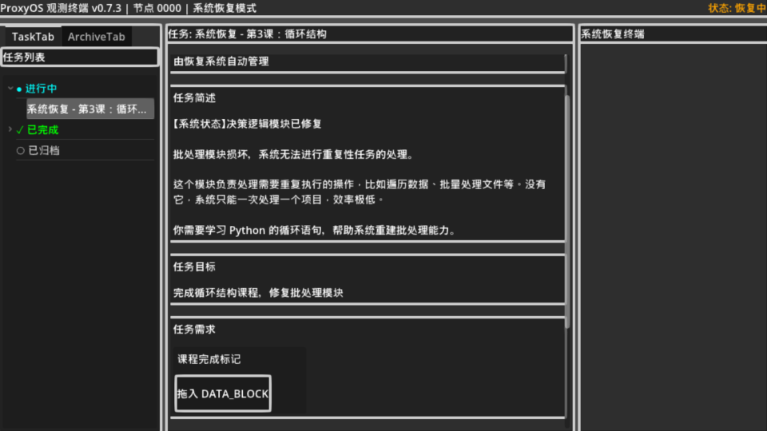

+++
date = '2026-01-04T18:15:00+08:00'
draft = false
title = 'Proxyos Weekly 020'
slug = 'proxyos-weekly-020'
series = ['proxyos-weekly']
categories = ['ProxyOS', 'DevLog']
tags = ['ProxyOS', '周报', '独立游戏开发', '技术日志']

+++

> TL;DR 概览
>
> 本周进度比预计的快，敲定了第二章剧情以及网页部分的实现，也初步重构了项目UI方式。准备文稿-要求AI按指定架构生成框架-调整细节-要求AI按文稿填充 这个工作流比我想象得更顺。



# 本期目标

- [x] 敲定茶馆论坛和玄云观论坛的风格并进行实现
- [x] 进一步优化第二章剧情
- [x] 思考当前界面如何进行优化
  - 这个 UI 是“世界的一部分”，还是“玩家的工具”？

# 进展速记（Changelog）

## 本期假设 / 预期
> 我当时以为世界是怎样的？
> 这个预期中，哪一条被证伪 / 被削弱 / 被确认？

## 本期确定性变化
> 哪些东西现在「更确定」或「被明确否定」了？
> “确认 X 不可行”
> “删掉 Y 抽象”
> “意识到 Z 是伪问题”

### 新增：

- 茶馆论坛
- 玄云观论坛
- 新的主UI

### 变更：

- 对第二章剧情进行优化，在保持玩家激励的同时避免叙事上过于夸大玩家作用导致后续难以保持激励
- 归档了旧的类win11桌面UI，改成了更接近专用client的UI

### 修复：

- 

### 删除：

- 

# 主要进展内容/本期关键判断点
> 我做出了哪些「如果错了也要付代价」的判断？

## 工作流优化

在序章和第一章时期，我更倾向于使用下面的流程来使用 AI
- 根据剧情大概走向确定需要的模块
- 编写对应模块的产品文档和设计说明书
- 要求 AI 对照文档完成实现
- 细化剧情并根据剧情编写游戏内容

但准备第二章剧情的那个阶段中，我在休息日里折腾了 Silly Tavern，并在 类脑ΟΔΥΣΣΕΙΑ 这个把 ST 玩出花的 Discord 服务前里看到了“要求AI根据剧情生成 UI”的神奇操作。

这让我意识到，实际上我并不需要准备很完善的设计。如果我准备一个完善的剧情稿，并提供总体的架构描述（各个帖子是单独的网页还是聚集在一个网页中，是纯静态还是从json加载数据，数据怎么传递等等），Claude 就会有足够的信息来实现一个能满足我要求的模块。

因此我在第二章改为使用如下工作流
- 准备完善的剧情文案
- 要求AI按指定架构生成框架
- 调整细节
- 要求AI按文稿填充

虽然期间也走了点弯路、抽了两次卡（Claude 太喜欢蓝紫色移动设备网页了），但还是以远超前两章的速度完成了大部分基础设施的搭建

## UI的路线

就像上一期说的，实际上这游戏涉及大量需要使用外部编辑器的真实编程内容，而我没法将其整合进游戏内部。所以这个游戏的最佳表现形式是窗口化而非全屏的类win11的操作系统模拟UI。

这一次我使用了如下结构（恢复阶段的Terminal比较特殊，被改炸了，下期修）

可以看到这把 Pocket 和 Archive 两个应用都做了大量简化并深度集成到了新的 UI 中，这实际上比单独的应用更能体现它们之间的配合关系，也更方便操作

而 Terminal 也作为平级的内容集成，这强调了第一章和第三章（规划中） Terminal 的重要性，也统一了 序章、第一章、后续 三个阶段的 UI 布局。而且这种布局和 HackerNet 有一定相似度，我可以在没灵感时参考 HackerNet 中的一些表现来做 UI 优化

# 瓶颈与问题清单
> 哪些问题还没解，但也许我已经知道“它们不是什么”？

# 下期计划（Next）

- [ ] 修好 Terminal
- [ ] 实现 轻聊

# 试玩版

预计第一个可玩版本将在第二章的第一个涉及外部编程的游戏内容完成后推出