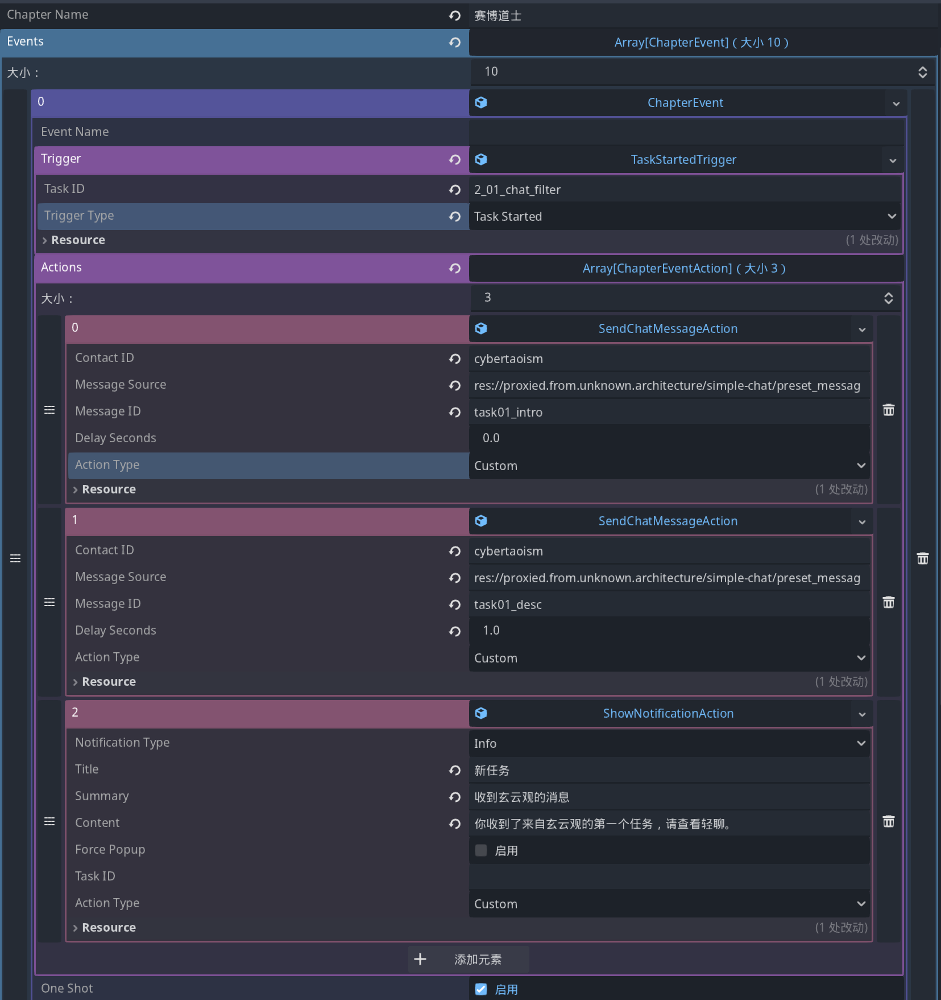

+++
date = '2026-02-02T09:50:00+08:00'
draft = false
title = 'Proxyos Weekly 029'
slug = 'proxyos-weekly-029'
series = ['proxyos-weekly']
categories = ['ProxyOS', 'DevLog']
tags = ['ProxyOS', '周报', '独立游戏开发', '技术日志']

+++

> TL;DR 概览
>
> 重构任务系统以支持编程任务的‘拖拽验证’机制；完成剧本系统基础架构；第二章数据段与 UI 适配就绪



# 本期目标

本期优先把蜜罐和任务系统搞定

- [ ] ### 网页内容

  #### 蜜罐聊天室 `proxy://cybertaoism.team/chat/vip`

  - [x] 页面框架（`chat/vip/index.html`）
    - [x] 更新实现：设定上聊天室里的用户不该发现自己在被“小助手”糊弄
    - [x] 更新实现：需要添加“调试中，尚未启用”的标识，否则玩家会质疑“为什么蜜罐聊天室里只有我发言，你是不是在说我是喷子”
  - [x] **动态状态显示**：根据任务完成状态显示不同内容
    - [x] 初始状态：显示"尚未启用"
    - [x] 任务 01 后：显示"回复逻辑尚未接入"
    - [x] 任务 02 后：立刻回复
    - [x] 任务 03 后：固定 3 秒延迟
    - [x] 任务 04 后：2-10 秒随机延迟

  ### 轻聊应用（SimpleChat）

  - [x] **任务消息流**：根据任务进度自动发送新消息
    - [x] 可以通过来自 EventHub 的事件触发特定联系人的特定预设消息（即剧本中的“普通信息”）
    - [x] 预设消息需要可以用 tres 配置
    - [x] 任务 01 普通信息 + 任务描述
    - [x] 任务 01 完成反馈 + 任务 02
    - [x] 任务 02 完成反馈 + 任务 03
    - [x] 任务 03 完成反馈 + 任务 04
    - [x] 任务 04 完成反馈 + 任务 05
    - [x] 任务 05 完成反馈 + 任务 06 触发

  ### 任务系统

  - [ ] **第二章任务定义**（需创建 `task_defs/chapter2/` 目录）
    - [ ] 通过任务的发布回调来触发预设的玄云观消息，在任务信息里加个任务接受后和任务完成后触发的轻聊信息 id 列表
    - [ ] 任务 01: 训练任务 - 识别敏感词
    - [ ] 任务 02: 小嘴抹了蜜 - 自动回复
    - [ ] 任务 03: 小嘴有时候抹了蜜 - 定时器
    - [ ] 任务 04: 小嘴有时候可能抹了蜜 - 随机延迟
    - [ ] 任务 05: 电子美颜与素颜 - 标签处理
    - [ ] 任务 06: 旧日之影 - 追查真相

  ### 编程任务框架代码

  - [ ] **玄云观任务文件**（需创建 `fs/cybertaoism/` 目录）
    - [ ] `chat_filter/main.py` — 任务 01 框架
    - [ ] `sweet_chat/main.py` — 任务 02 框架
    - [ ] `sweet_chat/checker.py` — 任务 03/04 框架
    - [ ] `chat_filter/truth_lens.py` — 任务 05 框架
  - [ ] **任务验证逻辑**
    - [ ] 任务 01: 敏感词检测（单元测试）
    - [ ] 任务 02: 自动回复（单元测试）
    - [ ] 任务 03: 定时器（时间检测）
    - [ ] 任务 04: 随机延迟（统计检测）
    - [ ] 任务 05: 标签处理（字符串比对）

  ### 数据段系统

  - [x] **第二章数据段定义**
    - [x] 外包资格解锁数据段

  ### 开发环境配置

  - [ ] **首次编程任务引导**
    - [ ] 控制节点备注弹窗机制
    - [ ] 引导任务自动解锁配置文件

  ### 其他

  - [ ] 解锁外包资格后，在控制节点通过任务系统提供开发环境配置的同时，解锁一个玄云观脚本验证应用。将脚本从 windows 拖入其中后会使用预设的测试数据进行验证，这个应该被配置成一个独立于任务，但是可以和任务通过任务 ID 关联的形式。
  - [ ] 标签处理插件应用到轻聊历史记录的逻辑（任务 05 完成后触发）
  - [ ] 章节完成检测（任务 06 完成后进入第三章）

# 进展速记（Changelog）

## 本期假设 / 预期

> 我当时以为世界是怎样的？
> 这个预期中，哪一条被证伪 / 被削弱 / 被确认？

任务系统可以暴露一个任务状态查询接口，蜜罐根据不同的任务完成状态加载不同的 JS

任务定义里加上轻聊的信息？还是轻聊监听任务完成？我倾向于后者

---

实际上又给自己上强度了，不是轻聊监听任务完成，而是使用数据驱动的通用剧本系统来触发轻聊的行为

## 本期确定性变化

> 哪些东西现在「更确定」或「被明确否定」了？
> “确认 X 不可行”
> “删掉 Y 抽象”
> “意识到 Z 是伪问题”

### 新增：

- 依赖任务完成情况的 js 模块加载路由
- 任务管理支持发送任务启动、结束信号
- 通用的剧本系统
- 轻聊的消息变更逻辑
- 轻聊的预设消息
- 轻聊的插件加载逻辑
- 第二章的剧本实现

### 变更：

- 蜜罐改成了能正经加载不同 js 模块的架构
- 优化了 Python 执行器，将其统一抽象为执行器对象，这样以后要扩展 js 之类的也方便
- 调整了界面布局，并为 ARCHIVE 的数据段显示逻辑变更做了适配。为了避免和 POCKET 抢显示区，数据段的详情会作为独立窗口弹出
- 调整任务间隔的过场效果，从之前仿系统关机重启的 黑屏+风扇 改成 灰化+加载图标，以适应当前控制面板界面
- 优化论坛里的昵称
- 优化时间设定标准并添加时间换算逻辑
- 

### 修复：

- 

### 删除：

- 

# 主要进展内容/本期关键判断点

> 我做出了哪些「如果错了也要付代价」的判断？

## 优化任务系统设计（剧本）

这个没啥好说的，我觉得通过 signal 来组织演出属实有点太死板了，所以搞了个剧本系统

比如下图这个就是一个中间过程，其一些细节还要细化（比如是使用 Resource 类型来判断事件/Action 类型，还是留着单独的字段以备万一之后要切成 json），但核心逻辑已经明确了。

这样我就可以自由控制什么时候给额外通知、什么时候触发什么消息之类的了，而且之后系统进一步扩展也十分方便



## 优化任务系统设计（编程）

本期有这么一条待办

> 解锁外包资格后，在控制节点通过任务系统提供开发环境配置的同时，解锁一个玄云观脚本验证应用。将脚本从 windows 拖入其中后会使用预设的测试数据进行验证，这个应该被配置成一个独立于任务，但是可以和任务通过任务 ID 关联的形式

借助于提前预演玩家操作，此处发现了一个严重 UX 问题

要说明这个问题是什么以及我要怎么修，我需要先复盘下当前任务机制

### 当前任务机制

当前任务机制主要受《Owell》影响，所以设计之初就有了“将数据段提交到某个地方来完成任务”这么个框架

然后为了让游戏系统有些深度，所以又结合《全网公敌》、《深空梦里人》等多个灵感来源对其进行了细化，即“提交特定错误数据段的时候会得到提示”、“有时候为了完成一个目标需要多个数据段”，后续还能进一步扩展数据段的合成、推演等等玩法

这看起来似乎什么问题，毕竟核心流程已经经过了《Owell》的检验，可以概括为

```
做某事 → 数据段自动出现 → 拖到任务需求处 → 全部需求被数据段满足时任务完成，快进时间到下一任务
```

它本质上是一个 `寻找信息` 和 `提交信息` 的循环，这两种元素都需要玩家的判断力，所以都能提供乐趣

但在编程任务上出了问题

### 编程任务的特殊性

编程任务的特点是，“对程序进行测试”本身也是一个操作，这会使流程变成

```
写代码 → 对程序进行测试 → 数据段出现 → 拖到任务需求处 → 全部需求被数据段满足时任务完成，快进时间到下一任务
```

注意到问题了吗？如果 对程序进行测试 是通过的，那么 拖到任务需求处 这个操作完全就是冗余的

而偏偏这游戏有大量编程任务，这种无效操作完全是对玩家的折磨

所以有两条路可走，要么是简化 `对程序进行测试`，要么是简化 `拖到任务需求处`

### A or B? or!

我觉得比起简化哪个，我们需要先问一个问题：我们目前这个`拖到任务需求处`的机制是为了什么？

- 后期问题较复杂时需要组合数据段推理出新的数据段（比如数据段 A 说一个人没去过某地，但数据段 B 说有个和这人形象一致的人出现在了某地，组合就能得到这人说谎需要进一步调查的数据段）
- 避免任务立刻完成，让玩家有机会检视自己拿到的东西（比如最初的那个 基准测试报告。txt，玩家点击下载链接就能得到数据段， 但玩家可以在完成任务前读一下这个报告）

但是在编程任务里，玩家并不涉及这两个目的，所以拖数据段本身就成了冗余操作。

所以我想，更核心的问题不是怎么在维持 `做某事 → 数据段自动出现 → 拖到任务需求处 → 全部需求被数据段满足时任务完成，快进时间到下一任务` 这一循环的同时精简其子类 `写代码 → 对程序进行测试 → 数据段出现 → 拖到任务需求处 → 全部需求被数据段满足时任务完成，快进时间到下一任务`的表现，而是“这个循环的核心是什么”

`寻找信息` 和 `提交信息`

在问“怎么把不同的任务的流程适配到这个核心循环”之前，我们应该先问“不同任务的流程中是否已经有部分对应着这个核心循环”

| 任务类型 | 寻找信息   | 提交信息         |
| -------- | ---------- | ---------------- |
| 信息收集 | 浏览网页   | 拖数据段到需求槽 |
| 编程任务 | 编写程序   | 对程序进行测试   |
| 组合推理 | 浏览数据段 | 多数据段组合     |

它们本身就是和核心循环对应的！

所以问题就明确了，不是要修改编程流程以适应任务系统，而是调整任务系统使其适应这个核心循环

### 新的方案

旧的任务流程是

```
任务下发（自动） → 浏览网页（寻找信息） → 数据段出现（自动） → 拖数据段到需求槽（提交信息） → 任务完成（自动） → 下一循环（自动）
```

它只是`信息收集`类型下的一个实例，而不是真正的通用`寻找信息` 和 `提交信息`循环，这才导致其不适应编程任务

那么按照我们先前的分析，`编程任务`类型的实例就应该是

```  
任务下发（自动） → 编写程序（寻找信息） → 数据段出现（自动） → 对程序进行测试（提交信息） → 任务完成（自动） → 下一循环（自动）
```

这时候有人可能就会问了：但`拖数据段到需求槽`不就和`对程序进行测试`互斥了吗？而且还是没解决怎么测试程序生成`数据段`的问题啊？

我觉得正相反！

在更高度抽象的视角下，我们不必局限于`数据段`的表现形式，在`编程任务`的实例下，`数据段`就是被编写的程序！

所以操作流程就很显然了：**把程序拖到任务需求上**

即扩展当前任务需求块的能力，使其接受 windows 文件 drop 并执行特定逻辑

### 额外内容

而且我发现自动下一循环的话难以处理同时接多个任务的情况，所以我觉得最好改成任务完成后手动决定下一循环，并在下一循环开始时派发新的 POCKET 任务

# 瓶颈与问题清单

> 哪些问题还没解，但也许我已经知道“它们不是什么”？

剧本系统的具体配置格式（Tres vs JSON）尚未最终敲定，但我想就算之后切成了 JSON，也可以用自定义序列化的方式弄出 tres，不用爆改

# 下期计划（Next）

下期优先搞定任务系统和开发环境配置，尽量打通一条路

## 任务系统

- [ ] 任务系统大修（包含脚本验证）
- [ ] **第二章任务定义**（需创建 `task_defs/chapter2/` 目录）
  - [ ] 任务 01: `2_01_sensitive_word_filter` — 训练任务 - 识别敏感词
  - [ ] 任务 02: `2_02_auto_reply_module` — 小嘴抹了蜜 - 自动回复
  - [ ] 任务 03: `2_03_scheduled_tasks` — 小嘴有时候抹了蜜 - 定时器
  - [ ] 任务 04: `2_04_random_events` — 小嘴有时候可能抹了蜜 - 随机延迟
  - [ ] 任务 05: 电子美颜与素颜 - 标签处理
  - [ ] 任务 06: 旧日之影 - 追查真相

## 编程任务框架代码
- [ ] **玄云观任务文件**（需创建 `fs/cybertaoism/` 目录）
  - [ ] `chat_filter/main.py` — 任务 01 框架
  - [ ] `sweet_chat/main.py` — 任务 02 框架
  - [ ] `sweet_chat/checker.py` — 任务 03/04 框架
  - [ ] `chat_filter/truth_lens.py` — 任务 05 框架
- [ ] **任务验证逻辑**
  - [ ] 任务 01: 敏感词检测（单元测试）
  - [ ] 任务 02: 自动回复（单元测试）
  - [ ] 任务 03: 定时器（时间检测）
  - [ ] 任务 04: 随机延迟（统计检测）
  - [ ] 任务 05: 标签处理（字符串比对）

## 开发环境配置
- [ ] **首次编程任务引导**
  - [ ] 控制节点备注弹窗机制
  - [ ] 引导任务自动解锁配置文件

## 其他
- [ ] 标签处理插件应用到轻聊历史记录的逻辑（任务 05 完成后触发，通过把玩家在 任务 05 的脚本复制到轻聊插件里加载来实现）
- [ ] 章节完成检测（任务 06 完成后进入第三章）

# 试玩版

预计第一个可玩版本将在第二章的第一个涉及外部编程的游戏内容完成后推出