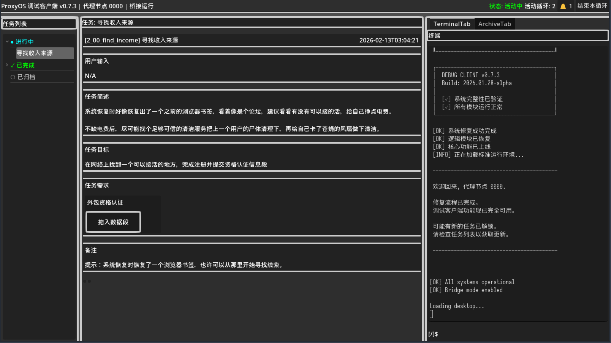
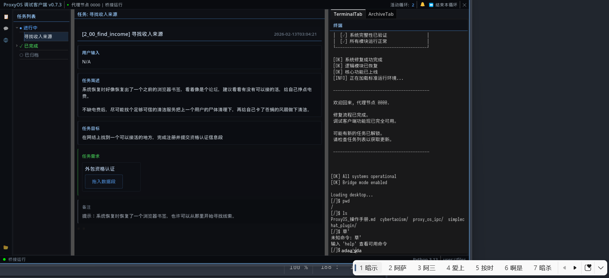

+++
date = '2026-02-12T09:44:00+08:00'
draft = false
title = 'Proxyos Weekly 032'
slug = 'proxyos-weekly-032'
series = ['proxyos-weekly']
categories = ['ProxyOS', 'DevLog']
tags = ['ProxyOS', '周报', '独立游戏开发', '技术日志']

+++

> TL;DR 概览
>
> 出现了远多于预期的问题，进行了大量细碎的重构



# 本期目标

- [ ] 测试第二章，并修复涉及开发环境准备和前两个任务的问题
- [ ] 优化开发环境准备和前两个任务的文案

# 进展速记（Changelog）

## 本期假设 / 预期

> 我当时以为世界是怎样的？
> 这个预期中，哪一条被证伪 / 被削弱 / 被确认？

这是个测试比开发辛苦的时代。jpg

不过前俩任务的问题主要是整个系统的问题，而系统本身应该问题不大，毕竟架构是我自己设计的，代码我都检视过没啥明显问题。

唯一风险比较高的就是之前的 Python 执行逻辑到通用执行器的重构，Python 的`sys.path`处理不确定有没有搞好，那块我没对具体逻辑细看。但应该问题不大，毕竟实际上没有加新能力

---

唉……问题一个接一个，具体见主要进展内容

## 本期确定性变化

> 哪些东西现在「更确定」或「被明确否定」了？
> “确认 X 不可行”
> “删掉 Y 抽象”
> “意识到 Z 是伪问题”

### 新增：

- 补充漏掉的“找工作”任务
- 调试面板

### 变更：

- 移除 BetterProcesses 插件并使用内置功能实现对应效果，以提高兼容性并解决环境变量不兼容问题
- 重构任务存档结构
- 调整任务发布机制，使第一章修复后和第二章的找工作发放之间的过程更顺滑
- 界面样式重构
- Terminal 输入优化
- 

### 修复：

- 执行器实现时引用了一些不存在的 ProcessNode 方法
- i18n 炸了
- ipc 的协议之前改字段没改全
- ControlPanel 图形输出部分的该清空的时候没清空，该显示占位的时候没显示
- 浏览器没存档

### 删除：

- 

# 主要进展内容/本期关键判断点

> 我做出了哪些「如果错了也要付代价」的判断？

## 移除 BetterProcesses 插件

因为改了执行器，我寻思最好重新验下第一章基础功能，然后就发现真的一语成谶了。Python 解释器的`sys.path`确实有很大问题，因为 BetterProcesses 的执行环境上下文和 Godot 的 OS.xxx 不互通。因此切换了方案，使用 4.4 刚出的`OS.execute_with_pipe`来做对应的功能

## 任务存档结构重构

修正后又发现不知道为啥执行完任务进度不更新

检查了一下发现异常路径是

- 任务系统的存档和包括数据段应用在内的其他普通应用存档不一致。这是本身是设计使然，玩家后期需要翻自己存档来玩 meta
- 但是玩家的核心存档只是任务系统，这导致当玩家切换存档后出现了“第一章的数据段已经解锁，但是任务没有完成”的情况
- 第一章十分特殊，它会自动提交数据段到任务来完成任务。但因为数据段已经解锁，重复解锁时出了问题，导致无法提交来完成任务

这个问题本质上是存档不一致的健壮性问题（有对应 segment 但是任务没更新），其还有潜在的“更新中删除了某些要求导致存档中的任务已经完成，但没被视为完成，而没有更多的 data block 可以提交”。而这些问题本质上都是 requirement 设计不当导致的（数据段类型的需求和脚本类型的需求被塞到了一个类里）。

比起发布后出这种没法改的问题，我寻思还是直接改吧

## 调整第二章最初的引导任务发布机制

先前的方案是这样的

- 第一章完成修复 6 后，对应的隐藏任务 6 被自动完成，找工作任务被自动发放。但是因为第一章任务管理器 pocket 离线，玩家看不到这个任务
- 重启进入第二章后，pocket 上线，玩家看到找工作任务

但实际试玩后发现体验十分割裂，控制节点不该在任务描述里一遍震惊一边描述任务

因此改成了下面的方案

- 第一章完成修复 6 后，对应的隐藏任务 6 被自动完成，隐藏任务 recovery_finish 被自动发放
- 重启进入第二章后，由 stage 变更事件触发 notification，控制节点在其中表示震惊
- 玩家确认 notification 的事件触发数据段自动提交到 recovery_finish（这个数据段不会被解锁，玩家看不到），recovery_finish 被完成，找工作任务被自动发放

这样控制节点就能先用 notification 震惊，然后再在任务描述里好好描述任务了

## 界面重做

先前界面是这样的

它有俩问题

- **丑**：布局机械、面板区分度低、标题栏信息密度不均匀，缺少视觉层次
- **App 切换丢失**：我当时在第一章打磨时重构界面，只关注 Terminal 和 Anora 了，没发现 App 切换丢了……

现在改成了这样

布局没有很大变化，只是在最左侧加了应用栏，优化了任务详情的区分度，增大了一点字体，然后改了配色

## Terminal 输入优化

之前的 [Proxyos Weekly 011](../proxyos-weekly-011/) 提到了为什么现在使用了自己搓 xterm 逻辑而非使用 pty。但当时没有提的是，为了简化输入处理，我使用了 LineEdit（也就是 Godot 里对应 HTML 的 input 的东西）作为输入对象

但是当时实现得有点挫，直接把它和 Terminal 分离了。

趁着重做界面的机会，把 LineEdit 弄透明并把 Terminal 的光标隐藏了，这下看起来像那么一回事了（你能在上图看到对应变更）

## 哈哈，Godot-WRY 又炸啦！

因为目前界面是 client 形式，使用的是透明背景无边框窗口，所以游戏内应用最好也得窗口化——不能用当前的嵌入式窗口（它不能超出游戏主窗口），而是应该用操作系统原生窗口。然后就发现切换完之后 WRY 的内容不显示了……

问题原因其实就是 Godot-WRY 用了默认的`window_get_position`，它只支持主窗口，要支持非嵌入式窗口需要使用支持传入`window_id`的`window_get_position_ex`

不过我 rust 技能点还没点完，所以靠 claude 了……就我的 rust 水平来看，修得很合理。也往原作者那提 PR 了

## 调试面板

第二章开始，游戏系统就开始复杂起来了，有时候我需要重复触发一些事件时，通过备份存档来做就有点麻烦了。因此添加了一个调试面板来方便我快速触发事件

# 瓶颈与问题清单

> 哪些问题还没解，但也许我已经知道“它们不是什么”？

数据段的提示悬浮窗不知道为啥不正常显示，但 ActivityBar 的应用窗口就能正常打开，下期我得看看是啥情况

# 下下期计划

- [ ] 修好数据段的提示悬浮窗
- [ ] 测试第二章，并修复涉及开发环境准备和前两个任务的问题
- [ ] 优化开发环境准备和前两个任务的文案

# 试玩版

预计第一个可玩版本将在第二章的主线内容完成后推出