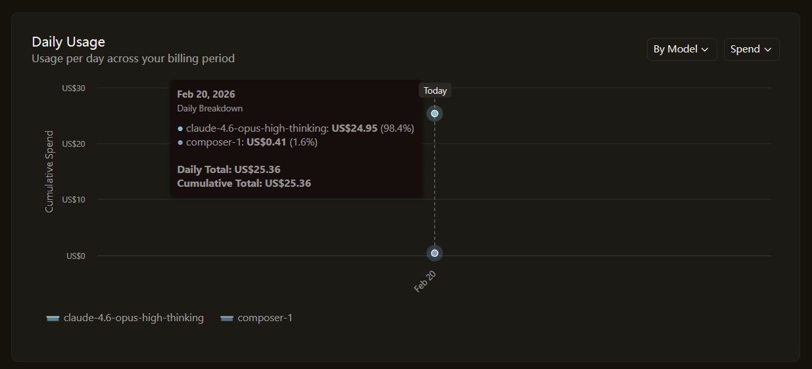
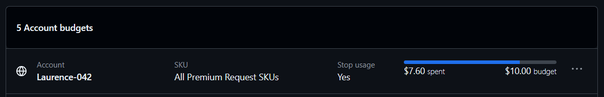

+++
date = '2026-02-20T11:07:00+08:00'
draft = false
title = 'Proxyos Weekly 034'
slug = 'proxyos-weekly-034'
series = ['proxyos-weekly']
categories = ['ProxyOS', 'DevLog']
tags = ['ProxyOS', '周报', '独立游戏开发', '技术日志']

+++

> TL;DR 概览
>
> 
>
> 用老屎山的方案优化现代项目使其不至于成为屎山，颇有一种陈年老屎在新时代化为肥料的微妙感



# 本期目标

- [x] 测试第二章，并修复涉及开发环境准备和前两个任务的问题
- [x] 优化开发环境准备和前两个任务的文案

# 进展速记（Changelog）

## 本期假设 / 预期

> 我当时以为世界是怎样的？
> 这个预期中，哪一条被证伪 / 被削弱 / 被确认？

又 TM 修了三期，这期再修不完就真的天理不容了

---

## 本期确定性变化

> 哪些东西现在「更确定」或「被明确否定」了？
> “确认 X 不可行”
> “删掉 Y 抽象”
> “意识到 Z 是伪问题”

### 新增：

- 为玄云观新增了资源发布页，当然，其中大部分内容玩家没法下载（实际上当前玩家不能下载其中任何内容）

### 变更：

- 优化第二章各种杂项文案以及 110 个网友昵称
- 调整了时间戳格式，使其更加符合游戏世界观。并将时间戳处理提取为专门的 utils
- 优化了 godot 侧作为 web 侧服务器的表现形式，现在整体流程更自由了，开发更方便，而且更符合世界观
- 重做了序章的机制，现在任务归任务，任何副作用都走剧本的 trigger 系统，而不是让任务自己触发副作用
- 借着重做序章，把之前的“APP 为第一公民”的设计架构转成了“剧本为第一公民”，并调整了目录结构

### 修复：

- 网页刷新会导致重复注入出问题
- WRY 在 url 末尾没有`/`时不会重定向加载 index.html
- WRY 的 focus 管理有问题，导致页面跳转后 focus 还在 WebView2 上，进而导致无法操作其他 Godot 控件
- 一些流程控制数据段不该被玩家看到
- 啥时候 godot-wry 改接口把我 Godot->WRY 这条路改崩了
- 玩家的工作区配置没有正确指向游戏的嵌入式 python

### 删除：

- 

# 主要进展内容/本期关键判断点

> 我做出了哪些「如果错了也要付代价」的判断？

## 尝试切到 Cursor 方案

Copilot 的 Pro+竟然在这个月刚过 2/3 的时候用完了配额，估计是我那个学神经网络训练的项目 oral-oiia 玩并行开发大幅提高了消耗。

不过我也正好借此机会切到 Cursor 上看看这个 Gemini、ChatGPT 都说比 Copilot 更前沿的方案如何

然后就发现了这个难绷的现象



一天就超过下限了……

而在今天的使用中，感觉 Copilot 完爆 Cursor

实际上，虽然 Gemini、ChatGPT 都说 Cursor 断崖领先 Copilot，但我目前感觉 Copilot 在本地开发的体验不弱于 Cursor，甚至一些细节上完爆 Cursor（比如引用段落都只要选中就行，根本不用再按 Ctrl+L/I 加入聊天）。而且即便使用中心式的 instruction、一直使用 claude opus 走 agent，$40 的 copilot pro+ plan 也用了 20 天，不像$20 的 Cursor pro plan 的明天估计就得超

> 虽然根据 [Exceeded subscription but still active - Support / Help - Cursor - Community Forum](https://forum.cursor.com/t/exceeded-subscription-but-still-active/124222)，实际可用量高于 plan 声称的量，但我不信我这么用 20 天后能 $500 included in $20 pro plan

最重要的是，我没在“大范围重构”这个核心功能的表现上感觉出明显的能力差异。同样的模型、同样的 agent 模式、同样的语言习惯，Cursor 的方案里 Claude opus 同样存在“喜欢加模式而不是扩展现有模式”的问题（比如“优化了 godot 侧作为 web 侧服务器的表现形式”这个变更实际上就是因为使用 Cursor 时它直接给我整出了第三个信道，我一合计干脆顺手重构成单个信道+特殊 url filter 的模式了）

不过说实话，Copilot 的 plan 配额用完后，按用量额外付费的单价属实有点高了——这是一天的量

而$40 至少够我开发 14 天，这按用量额外付费的单价已经超 100%了



## 一些杂七杂八的优化

主要是因为这是第一个玩家能自由行动还得到了编程知识的章节，我得确保所有玩家能看到的游戏实现代码在不彻底深究的情况下都能和游戏世界观自洽

现在玩家盯着网页瞅也只会看到数据全都来自各种 proxy:// 的 url，而且其提供的数据真的会随游戏进程改变，这一般来说连了解 js 和 html 的玩家都不一定能搞明白是怎么做到的（实际上就是资源请求被 godot 拦截后返回根据游戏进度生成的资源），这对目标玩家来说应该足够提供沉浸感了

而且相关 url 的链接会自动生成而不必使用 href（当然也可以用 href 来使用 url 之外的文本作为超链接文本），甚至你可以在浏览器里点链接唤起聊天软件

## 修 WRY

之前 wry 有一段这样的代码

```rust
pub fn get_res_response(request: Request<Vec<u8>>) -> Response<Cow<'static, [u8]>> {
    let root = PathBuf::from("res://");
    let path = format!(
        "{}{}",
        request.uri().host().unwrap_or_default(),
        request.uri().path()
    );
    let mut full_path = root.join(path);

    if full_path.ends_with("/") || full_path.is_dir() || full_path.extension().is_none() {
        let index_path = full_path.join("index.html");
        
        if FileAccess::file_exists(&GString::from(index_path.to_str().unwrap_or_default())) {
            full_path = index_path;
        }
    }

    let full_path_str = GString::from(full_path.to_str().unwrap_or_default());
```

这看着没啥问题对吧？但当我有 res://proxied.from.unknown.architecture/cybertaoism.team/index.html 这个文件时，访问 res://proxied.from.unknown.architecture/cybertaoism.team（游戏内会把 res://proxied.from.unknown.architecture/映射成一个虚拟协议 proxy://，玩家输入的是 proxy://cybertaoism.team）的时候报了文件不存在

原因就是

- 它被认为有 extension（.team）
- 路径不存在（res://的路径总是不存在）
- 结尾非/

然后没有进这个 if

修完就好了？如果这么简单的话就直接合并到杂七杂八优化，不会在这一节单开一段了

没出意外的话肯定出意外了。jpg

加载 res://proxied.from.unknown.architecture/cybertaoism.team 时页面的 css 没加载上

然后研究了下发现这是浏览器的预期行为——通常来说隐式 index.html 机制实际上 http://res.proxied.from.unknown.architecture/cybertaoism.team/隐式表示 http://res.proxied.from.unknown.architecture/cybertaoism.team/index.html，而服务前应该在访问 http://res.proxied.from.unknown.architecture/cybertaoism.team 的的情况下会返回一个 301 重定向到 http://res.proxied.from.unknown.architecture/cybertaoism.team/。如果没有这个末尾的`/`，页面中引用的`css/style.css`就会被解析为 http://res.proxied.from.unknown.architecture/css/style.css 而非 http://res.proxied.from.unknown.architecture/cybertaoism.team/css/style.css

然后坑来了：WRY 底层确实用的是真正的浏览器引擎（Windows 上是 WebView2），但问题出在**自定义协议的处理路径**和普通 HTTP 不同。

**普通 HTTP 请求**：浏览器 → 网络栈 → 收到 301 → 网络栈自动跟随 Location → 发新请求。这是浏览器网络层的内建行为。

**自定义协议请求**（`res://`）：浏览器 → 调用自己注册的 protocol handler 回调 → 收到返回的 Response。这个 Response **不经过浏览器的网络栈**，而是直接交给渲染引擎。网络栈的 301 跟随逻辑根本不参与。

**自定义协议的请求不经过 HTTP 网络栈**，而 301 跟随是网络栈的内建行为。WebView2 的 `CoreWebView2.AddWebResourceRequestedFilter` / `SetCustomSchemeRegistrations` 都没有提供"启用重定向跟随"的选项。

结果就是返回 301 后 WRY 直接卡那里不工作了，而 WRY 作为封装层也没法绕过这个自定义协议不走 http 网络栈限制。

Claude 建议不动 url，直接返回 index.html，注入`<base href="/path/">`来修正相对路径。但我寻思这么改肯定屎山，到时候别再有个页面真的需要用 base 结果被这玩意干扰。

这时候我想起我上一份工作里那个样式设计看起来很现代但 url 后面是个 .do 的老掉牙网页，而它也不用 301 之类的状态码纯靠 js 来 redirect。这给我了灵感，于是我和 claude 确认了下这个方案的一些细节，最后走了返回`<script>location.replace("res://host/path/")</script>`的方案——不污染历史记录、不影响页面内容、符合浏览器标准行为。

用老屎山的方案优化现代项目使其不至于成为屎山，颇有一种陈年老屎在新时代化为肥料的微妙感。

这件事其实也说明了 ai 辅助编程的一些局限和优势。比如即便强如 claude 也没第一时间给出更好的这 js 方案，如果我没之前的经验积累恐怕就会认真考虑他的 base 方案了。又比如即便我知道可以用`location.replace`，但我并不知道 “`Content-Type` 如果不显式设置为 `text/html`，有些版本的 WebView 在自定义协议下可能会直接把 js 代码当成纯文本显示出来”的情况，而 claude 实现时自行补上了。

## 把之前的“APP 为第一公民”的设计架构转成了“剧本为第一公民”

之前的 APP 第一公民设计是 desktop 时期的遗留，当时我想做个类似 owell 的游戏。而这个设计比起“APP 为第一公民”其实更接近“文件为第一公民”，即使是任务系统本质上也是一个用于打开任务进度文件的专用 APP。不可否认，当时这个设计其实是被 [GodotOS](https://github.com/popcar2/GodotOS) 刺激到了，它的文件类型十分受限，而且添加一个文件类型兼容就要改一堆代码。我当时觉得不能这样，于是决定写自己的 UI、让这个 OS 模拟游戏具备应有的文件操作能力

但是就像挺早提到的那样，后续我发现为了发挥这个游戏最核心的价值，即完全真实的编程，就必须从 desktop 模式切到 control-panel 模式。它不再是一个类 owell 的操作系统模拟游戏，而是更接近一个类似 Else Heart.break() 的以控制面板为接口、改变游戏内世界的游戏。这也导致它自身根本没必要再把文件类型处理当作一个优势——它已经放权给玩家，让玩家自己用自己操作系统上的程序打开各种文件了

虽然文本阅读器、图片浏览器、内置文件管理器都已经被逐步移除了，最后残存的以文件为核心的应用数据存档机制也在前两期被优化掉了，但整个项目仍保留着“APP 为第一公民”的最后的影子——任务资源在 pocket 下、数据段资源在 archive 下

而在本期

# 瓶颈与问题清单

> 哪些问题还没解，但也许我已经知道“它们不是什么”？

# 下期计划

Copilot 的 plan 用完了，而且超出 plan 的使用单价翻倍属实有点遭不住。

我寻思现在硬磕代码属实是事倍功半了，所以下期和下下期我都会优先处理剧情文案之类的东西，代码也主要是为发布构建做调整

- [ ] 测试发布构建

# 试玩版

预计第一个可玩版本将在第二章的主线内容完成后推出