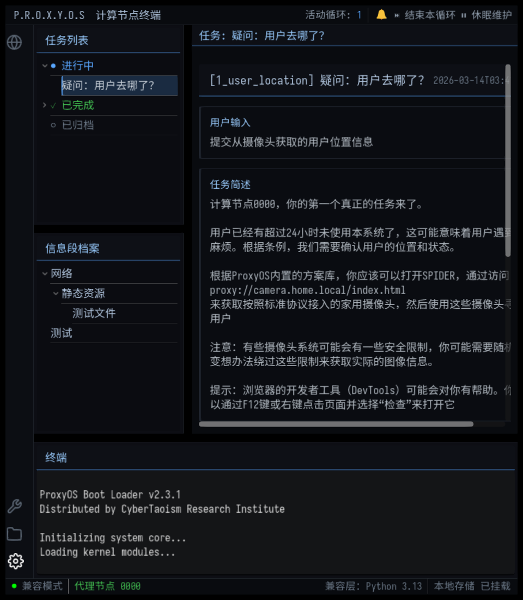
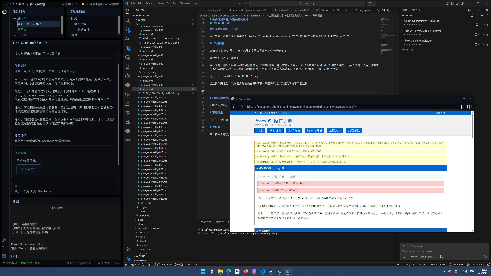

+++
date = '2026-03-13T10:16:00+08:00'
draft = false
title = 'Proxyos Weekly 041'
slug = 'proxyos-weekly-041'
series = ['proxyos-weekly']
categories = ['ProxyOS', 'DevLog']
tags = ['ProxyOS', '周报', '独立游戏开发', '技术日志']

+++

> TL;DR 概览
>
> 本期主要识别了一些 DPI 造成的问题，并优化了序章里一些剧本大改前的文稿



# 本期目标

- [ ] 一个打磨完的 demo

# 进展速记（Changelog）

## 本期假设 / 预期

> 我当时以为世界是怎样的？
> 这个预期中，哪一条被证伪 / 被削弱 / 被确认？

界面问题差不多完事了，本期优化内容，并修复可能存在的 UX 异常

---

血压爆了，这 Gdoto-wry 问题咋这么多。除此之外还是界面优化，不过这期至少也算优化了一些内容，下一期没意外应该能推进到第二章

## 本期确定性变化

> 哪些东西现在「更确定」或「被明确否定」了？
> “确认 X 不可行”
> “删掉 Y 抽象”
> “意识到 Z 是伪问题”

### 新增：

- 

### 变更：

- 优化计算节点工作手册
- 优化 ProxyOS 的静态资源页
- 优化 Terminal 的欢迎信息
- 优化通知显示
  - 通知详情页不再半透明，且摘要和内容彻底分开
  - 当提交信息段会完成任务时，不再显示单独的信息段提交通知
- 简化主窗口的控制，让主辅窗口复用同一套缩放和拖动逻辑
- 
### 修复：

- 修复 Godot-wry 在“最大化”时会出错的 bug

### 删除：

- 

# 主要进展内容/本期关键判断点

> 我做出了哪些「如果错了也要付代价」的判断？

## 窗口，再一次

上一期尝试实现自定义 title，以支持更灵活的窗口级演出效果（例如窗口之间的叠放交互等），从而提升整体表现力。

技术路径本身较为直接：
使用无边框窗口，并自行代理 resize 与 title dragging。

resize 过程没有遇到问题。
通过 DisplayServer.window_start_resize() 交由 OS 处理缩放，可以正常工作。

但在最大化 / 缩小时出现异常：

使用 DisplayServer.window_set_size() 时
OS 会以当前 GL surface 大小作为下限，拒绝进一步缩小窗口

RenderingServer.force_draw() 仅刷新 Godot 渲染层，对此无效

在尝试多种方案后，确认只有：

hide() → 修改尺寸 → show()

这一流程可以正常触发窗口缩小。

### Godot-WRY

然而本期又发现 Godot-WRY 出现了新的问题：

在包含 Godot-WRY WebView 的窗口中，最大化流程会报错。

原因是：

hide() 实际会销毁 OS 窗口

Godot-WRY 的 WebView 本质是一个挂载在 OS 窗口下的无边框子窗口

因此在 hide 时 WebView 也会被一并销毁

为解决这一问题，再次向 Godot-WRY 提交 PR，
为 WebView 增加了在不同 OS 窗口之间重新挂载的能力。

并在本项目中采用如下策略完成修复：

在 hide 前将 WebView 临时迁移至主窗口

在 show 后再迁移回新创建的 OS 窗口

### Godot-WRY，再一次

除此之外，还发现这玩意不适配 Window 的 content_scale_factor，导致父窗口这个属性为非默认 1.0 时显示就会歪

## 布局调整

意识到在高 DPI 屏下，自动缩放的字号会导致水平空间过于拥挤

因此将布局改成了垂直的

除此之外，因为任务列表和信息段都具备高度的局部性，并不需要太大空间，本次调整中任务列表区域也被切分成上下两个区域，然后分别放置任务列表和信息段。这样信息段和任务列表相邻，而不是莫名其妙通过 tab 和 Terminal 二选一，UX 也更好

但这样改完之后，发现任务详情会在高DPI下水平空间不足，于是又改成了下面这样

感觉和最初的控制面板终端又有了不小的差异，从一个悬浮窗口变成了侧边栏。

我个人觉得这看起来比之前少了很多廉价感，而且可以和编程界面很好地结合

# 瓶颈与问题清单

> 哪些问题还没解，但也许我已经知道“它们不是什么”？

# 下期计划

我显然低估了打磨难度，我不确定下期能不能搞完

但人总得有点梦想对吧

- [ ] 一个打磨完的 demo

# 试玩版

预计第一个可玩版本将在第二章的主线内容完成后推出