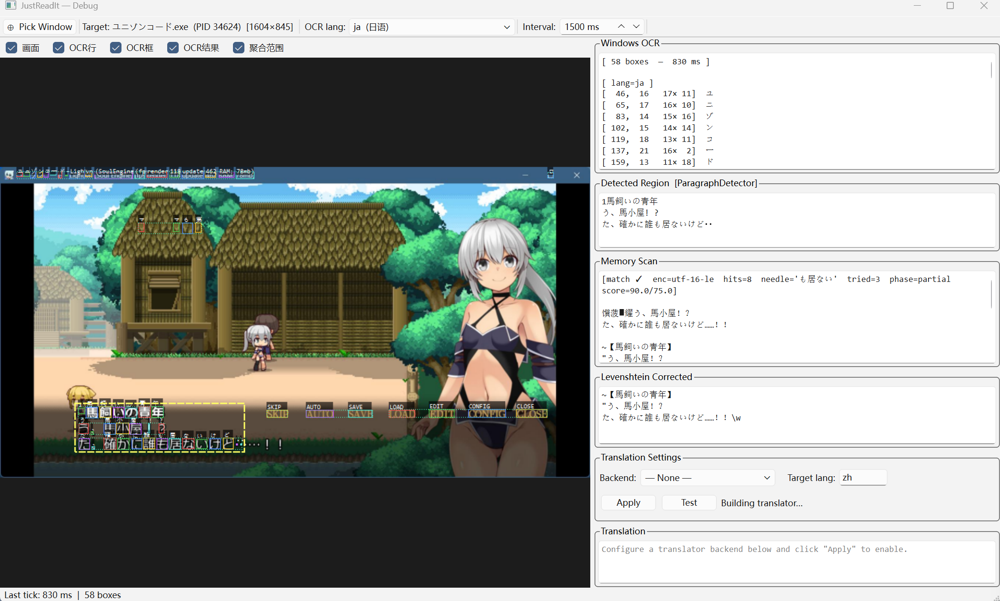

+++
date = '2026-03-16T09:48:00+08:00'
draft = false
title = 'Proxyos Weekly 042'
slug = 'proxyos-weekly-042'
series = ['proxyos-weekly']
categories = ['ProxyOS', 'DevLog']
tags = ['ProxyOS', '周报', '独立游戏开发', '技术日志']

+++

> TL;DR 概览
>
> 又跳票了……但我确实在肝，而这些问题，我也确实很难说如果我经验足够我就能预见



# 本期目标

- [ ] 一个打磨完的 demo

# 进展速记（Changelog）

## 本期假设 / 预期

> 我当时以为世界是怎样的？
> 这个预期中，哪一条被证伪 / 被削弱 / 被确认？

序章内容差不多了，第一章先前单独打磨过问题应该不大，但第二章可能需要做些调整，有些网站可能需要调整架构。所以还是有希望本期出demo的

---

第一章问题根本很大，其机制是最特殊的。而之前刚实现第一章并打磨时，因为对项目整体仍有不小的设计缺陷（比如主界面的形式），实现时的一些不是很恰当的地方也埋了雷

## 本期确定性变化

> 哪些东西现在「更确定」或「被明确否定」了？
> “确认 X 不可行”
> “删掉 Y 抽象”
> “意识到 Z 是伪问题”

### 新增：

- 现在进入第二章后，茶馆和玄云观的帖子不会那么多了，会随玩家任务进度增加
  - 随任务进度出现的帖子的时间会被根据任务完成时间适配

### 变更：

- 优化序章《用户去哪了》任务对应的网页的相关文案
- 优化应用窗口默认大小和位置，现在它和主窗口配合得更好了
- 通知不再在主窗口右下角弹出，那样太容易被忽略了，改成了在鼠标光标附近弹出
- 优化第二章《女朋友》这一帖子内容，补充在之前某次优化文本中遗漏的关键信息，并添加了一些背景设定
- 将通知的小popup从主窗口右下角改成光标位置右下角的单独window，现在它不会被忽略了
- 将通知的对话框从主窗口里改成屏幕中间的单独window，现在它更像对话框了
- 优化通知对话框内容样式，让summary默认折叠
- 添加通知的sfx
- 将部分sfx替换成更合适的
- 优化了第一章的控制逻辑，现在它逻辑更一致了
- 优化第一章里给玩家的说明文档，现在它的背景和设定更一致了，而且把一段无效内容换成了 Terminal 的QoL功能说明
- 调整程序运行时的输入模式，使其仍使用 LineEdit 按行输入
- 优化了主窗口的三栏比例，从20：55：25改成了27.6：44.8：27.6（即1：1.618：1），显著增大任务和信息段区域占比，以此增加视野内的条目
- 为未读消息计数和休眠维护之间添加分隔
- 重构主窗口初始化流程，简化了不同章节的控制器加载模式
- 优化构建流程，现在构建更一键式了
- 将运行环境检查的调试信息从教学脚本挪到boot_animation，毕竟后者本质上就是在检查脚本执行器是否准备完善
- 优化了输出工具的默认输出样式，现在显示会更加紧凑
- 优化了教程中的错误场景引导，并让正确线路提示更加明显

### 修复：

- 修复了 Godot-WRY 的鼠标事件被发到主窗口的bug
- 修复了 Godot-WRY 的鼠标事件坐标存在偏移的bug
- 修复作为dialog直接打开的消息仍被视为未读的bug
- 修复了第一章的终端输出welcome信息后没有正常输出输入提示符的bug
- 修复了 terminal 异步命令没执行完就输出输入提示符的bug
- 修复了第一章里设置和调试功能入口被错误隐藏的bug
- 修复了debug信息在不开debug时也显示的bug
- 修复了执行自定义脚本时光标位置不对的bug
- 修复“当玩家选中xterm里一段文字，然后点击右键复制，再在原地点击右键粘贴，随后按下任何按键尝试继续输入，都会导致xterm被大范围选中”的bug
- 

### 删除：

- 移除第一章的冗余welcome信息
- 移除了git插件，这玩意还不如直接vscode

# 主要进展内容/本期关键判断点

> 我做出了哪些「如果错了也要付代价」的判断？

## Godot-WRY……

之前我在给它适配多窗口的时候只适配了创建，但操作是另一批API，而我没意识到

而那个坐标偏移问题则是历史问题，我也不知道为啥其他人没发现

## 动态解锁帖子的机制

这个没啥好说的，玩家一进第二章直接被大量帖子糊脸既让玩家信息过载导致容易遗漏信息，又导致第二章后续的几个任务只有“任务对应的网站发生变化”这么一点不一定足够的反馈

让帖子随任务解锁就两难自解了

## 调整程序运行时的输入模式，使其仍使用 LineEdit 按行输入

因为这个游戏预期不会有那么复杂的非按行输入的脚本，也不会让玩家去折腾命令行程序怎么输出控制字符来实现原地更新文本。使用 LineEdit 兼容性更强而且更加健壮

## 副项目

副项目的翻译工具倒是进展顺利

在改换思路，使用 Memory Scan 代替 Function Hook 后，稳定性、效率、易用性都有了显著提升

目前已经实现了干净文本和准确位置的获取，接下来只需要
- 实现翻译模块
  - 提供个免费的试用翻译
- 实现遮罩
- 界面优化
- 没准需要rust重写来改善性能

……

一点都不是“只需要”的程度啊……

# 瓶颈与问题清单

> 哪些问题还没解，但也许我已经知道“它们不是什么”？

倒是没啥不可解的问题，也没啥瓶颈，就是……事情很繁杂，即使我把它们记在了`确定性变化`一节，我现在看着它们写这段文字的时候也没法预见我接下来可能还会有哪些问题需要解决

# 下期计划

人总得有点梦想对吧，没准我这期把所有坑都踩了呢

- [ ] 一个打磨完的 demo

# 试玩版

预计第一个可玩版本将在第二章的主线内容完成后推出