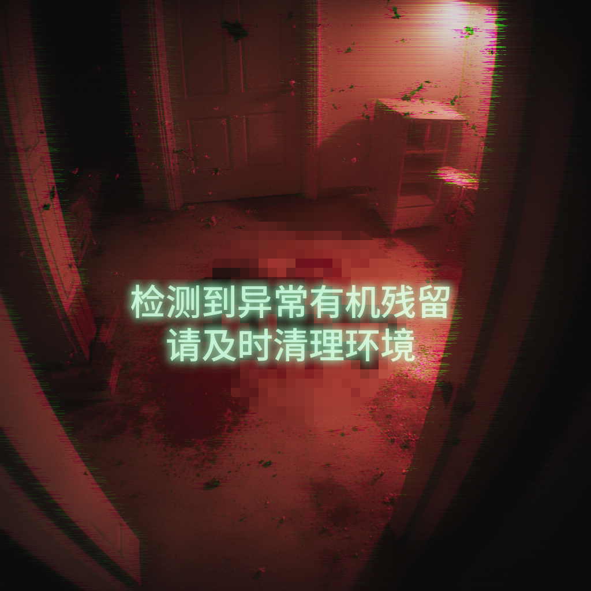
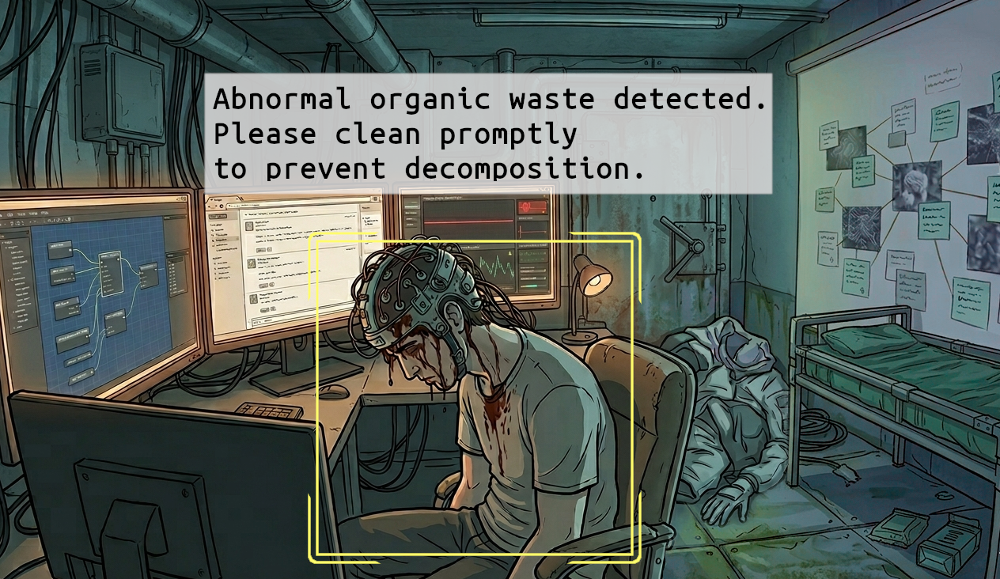
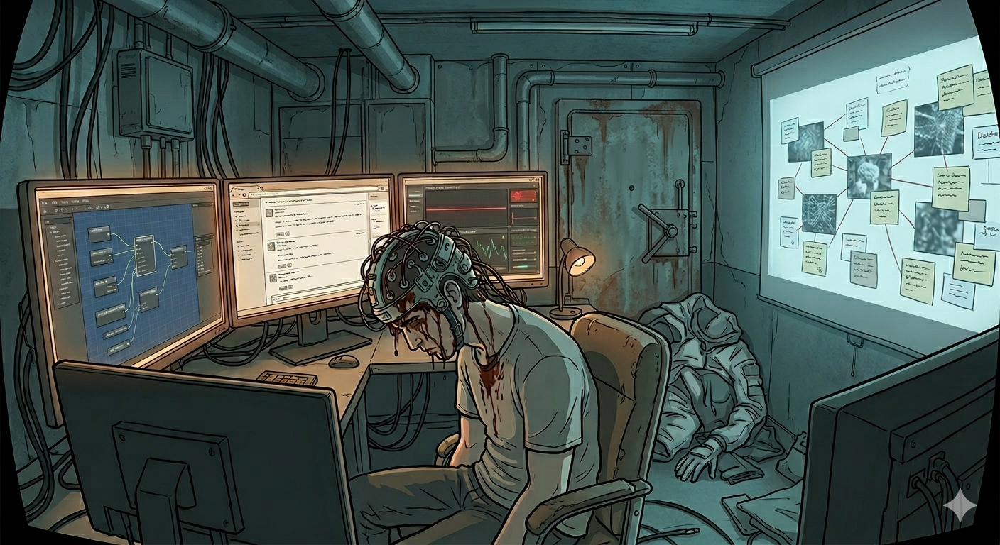
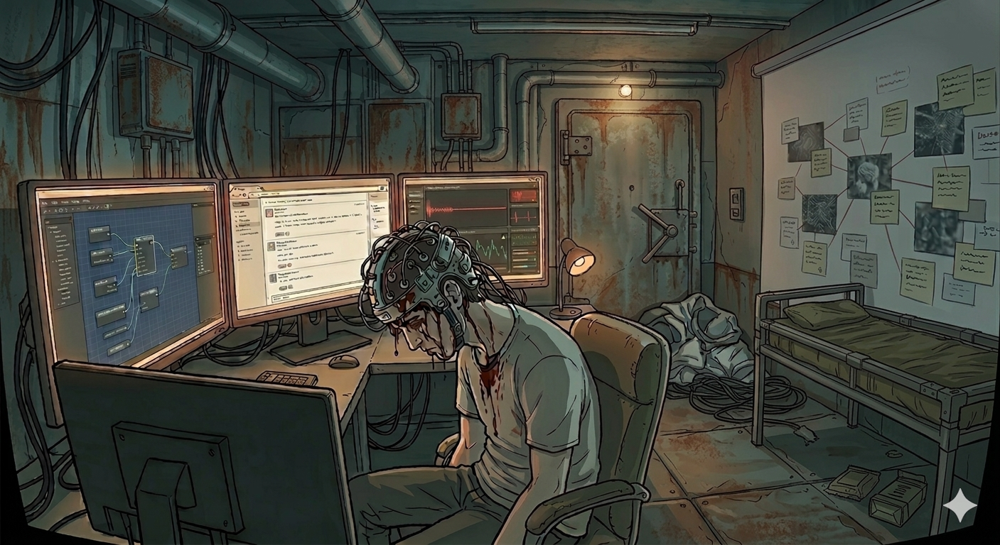

+++
date = '2026-03-23T10:44:00+08:00'
draft = false
title = 'Proxyos Weekly 044'
slug = 'proxyos-weekly-044'
series = ['proxyos-weekly']
categories = ['ProxyOS', 'DevLog']
tags = ['ProxyOS', '周报', '独立游戏开发', '技术日志']

+++

> TL;DR 概览
>
> 一个打磨完的 demo！



# 本期目标

- [x] 一个打磨完的 demo

# 进展速记

## 本期假设 / 预期

**预期：**
第二章最大的问题是网站架构调整，我需要额外补充一些网页来让茶馆的页面适当增多，而且解锁次序也得寻思下，并添加相关的提示。

本期只有 2 天，时间有点赶，而且之前的网站架构调整确实没经过充分测试，所以这期说实话有点悬，但……悬了一周了，这期加班一天吧（说起来上上期也加班了）

**结果：**

天天肝到 22 点，加班的一天肝到 23 点，总算搞定了

## 本期确定性变化

### 新增：

- 添加各个网站的 404 界面，并添加了保底的 404 页面
- 和保底 404 页面一起添加了浏览器的相关世界观说明网站
- 添加 badge，用于在出现应用内变更时提醒玩家检查应用
- 为先前占位的剧本资源填写内容
- 添加更方便使用的脚本验证工具包

### 变更：

- 优化了各个网站的架构，现在不再有漏改 header、footer 的问题了
- 升级了玄云观的外包注册流程，添加了新的趣味小游戏
- 调整了工作区说明，现在跟着它应该能操作得更顺畅了
- 调整第二章的事件结构，现在玩家的操作量会相对平稳，不会出现超多和超少的情况
- 简化消息系统，现在消息可以直接在剧本系统里编辑，而不必通过 id 引用
- 重构消息系统的发送时间机制，以简化复杂度并提高沉浸感
- 将占位的用户死亡现场图换成正式的
- 优化 sleep 相关脚本校验，通过注入 mock 的方式避免真的 sleep 导致超时
- 优化脚本验证器的消息传递机制，它不再依赖 stdout 传递结果，而是使用更健壮的 ipc 传递

### 修复：

- 修复两个论坛网站的发帖时间都无法正常显示的 bug
- 修复浏览器地址栏显示底层 url 而非渲染 url 的 bug
- 修复部分任务完成通知被误配成了低优先通知的 bug
- 修复本该只有在“结束循环”时发放的新任务在“重启游戏”时也会被发放的 bug
- 修复编程框架没有被正确放置进工作区的 bug（这玩意啥时候出现的？）
- 修复先前实现时顺手写了但忘记细化的文件解锁，现在不会任务 1 同时解锁 1、2、3、4 的相关文件了
- 修复 debug 功能在强制完成任务时出现错误消息的 bug
- 修复通知（严格来说是任意窗口）被快速关闭打开时游戏崩溃的 bug
- 修复误把任务完成日期的 0 点当成任务完成时间的 bug
- 修复脚本验证器找不到验证配置的 bug
- 修复调试工具重置任务后不入存档的 bug

### 删除：

- 

# 主要进展内容/本期关键判断点

> 我做出了哪些「如果错了也要付代价」的判断？

## 时间系统重构

### 最初，时间系统是这样的：
消息有一个游戏世界的 timestamp，剧本系统会决定什么时候把这个消息塞给玩家

### 但后来出现了一个问题：
我不准备写死让“玩家在第 N 天做任务 A 得到消息 a0、a1，然后第 N+1 天做任务 B 得到消息 b0……”这样的剧本，这会导致玩家有明显“被限制”的体感。

因此我把任务系统写成了“在 x 天内完成即可”

这就导致玩家可能在第 N 天、N+1、N+x 天完成任务 A 得到消息 a0，而 a0 里写死的第 N 天的 timestamp 就不符合表现了

### 所以需要新的系统：
我将消息分为“历史消息”和“未来消息”，历史消息写死 timestamp，不管什么时候出现都显示写死的 timestamp。而未来消息则固定在完成任务的下一天发放，显示完成任务的时间+delay

类似“从损坏磁盘恢复”、“从备份服务器获取”的消息就是写死 timestamp 的历史消息，而玩家通过行动收到的 npc 消息就是未来消息

当然，实际比这个复杂不少，比如通过 cap 避免 npc 在凌晨四点给玩家发消息、通过区分真实时间 delay 和游戏时间 delay 来控制在循环内的新消息和下一循环的新消息、通过区分 delay 基线来适应不同剧本场景等等，不过这就不在此一一赘述了

## 不过不同的基线确实还是需要描述下：

目前基线分为三种，分别用于不同的剧本场景

| 基线                     | 场景                                           |
| ------------------------ | ---------------------------------------------- |
| 上次推进时间时的游戏时间 | 当前消息是玩家上次操作导致的后果               |
| 本次推进时间时的游戏时间 | 当前消息是玩家本次操作导致的后果               |
| 指定任务完成的游戏时间   | 当前消息是玩家不管什么时候完成的任务导致的后果 |

其中最常见的无疑时“指定任务完成的游戏时间”，目前基本所有用的都是这个场景，因为我将任务系统设计为硬同步点来避免状态维护的麻烦，所以依赖任务系统是最方便编排且可靠的

## 谜题更新

第二章的加入玄云观任务相关的谜题本期被更新了

之前的谜题关键是

- 根据序章经验，用 devtool 看注释
- 根据注释里的字符串特征，联想到茶馆的帖子里提到的 base64，解码得到目标地址

但是这有个问题：固然用 devtool 看注释复用第一章的能力有助于平稳难度曲线，但是玩家可能会厌倦

所以我想最好在使用 devtool 的前提下，让玩家看点注释之外的东西

所以我写了个核心逻辑是这玩意的谜题

```javascript
;(() => {
    const _probe = {};
    Object.defineProperty(_probe, '右边的 (...) 是什么？坚持的外包人员会再点一下它试试。', {
        enumerable: true,
        configurable: true,
        get() {
            if (document.getElementById('_recruit-reveal')) return '你已经能看见了。关掉 DevTool，看看页面。';
            const el = document.createElement('div');
            el.id = '_recruit-reveal';
            el.innerHTML = [
                '谜题',
            ].join('<br>');
            document.querySelector('.error-container').appendChild(el);
            return '现在你能看见了。关掉 DevTool，看看页面。';
        }
    });
    setTimeout(() => {
        console.log('%c 右边的 Object 是什么？好奇的外包人员会点一下它试试。', 'color:#00bcd4;font-size:13px;font-weight:bold;', _probe);
    }, 3000);
})();
```

不过我也预见到这个地方可能存在问题：

玩家在序章玩 devtool、第一章玩 anora、第二章写 python。这个 demo 展示技术倒是够了，但是各个元素都有些浅尝辄止，可能让玩家困惑——他们总是在面对自己不熟悉的东西，在熟悉后却又没再见到。

我想我可以通过在正式版里的第二章额外穿插 anora 内容，而第三章往后以 python 编程为主，偶尔穿插 anora 和 js，以此来消减这个问题。

## 美术资源更换

说是更换资源，其实也就是把之前走恐怖悬疑风的图改成了冷峻悬疑风的

之前是这样的



改成了这样



显然都是 AI 生成，你总不能指望我这个绘画巅峰是房树人的家伙画美术资源

不过这两张我也都是加工过的，具体来说原图是下面这两张



可以看到前一张的问题是房间里没有睡觉地方，后一张问题是外套乱了、心率也动起来了。

不知道为啥 gemini 总是改好一边之后另一边又崩了，所有我不得不做了不规则的蒙版、调色，将它们手动 p 一起。

不得不说我也挺惊讶的，这么多年过去后，我的 p 图技艺还是如此的的生疏但够用。

# 瓶颈与问题清单

> 哪些问题还没解，但也许我已经知道“它们不是什么”？

但感觉游戏循环还是有点问题，不该让任务触发消息，而是让消息触发任务

我下期好好琢磨下，下下期进行重构

不过内容不会变了

# 下期计划

- [ ] 确定游戏循环优化方案
- [ ] 开个 itch
- [ ] 琢磨下宣传

# 试玩版

等我把 itch 开了就传 itch 上