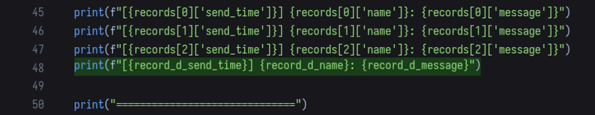

+++
date = '2026-05-19T10:33:00+08:00'
draft = false
title = 'Proxyos Weekly 059'
slug = 'proxyos-weekly-059'
series = ['proxyos-weekly']
categories = ['ProxyOS', 'DevLog']
tags = ['ProxyOS', '周报', '独立游戏开发', '技术日志']

+++

> TL;DR 概览
>
> 大改内部编辑器，使其支持多行编辑



# 本期目标

- [ ] 把 demo 从 alpha 打磨到 beta
  - [ ] 完成测试
    - [ ] 第一章 
      - [ ] 【低优先级】xterm 的 col 似乎计算不太对劲，有时候一行末尾的字只显示了一半，需要看下 xterm 实现，必要的话进行修复
      - [ ] 【低优先级】xterm 的 cursor_pos 在 cursor 不在视野内时返回末行 pos 是个 bug，而且在外面基本没法绕，只能修 xterm。这个 bug 不修会导致无法在向上滚动时正确隐藏输入区
    - [ ] 第二章
- [ ] beta 打磨完成后
  - [ ] 开个 itch
  - [ ] 琢磨下宣传

# 进展速记

## 本期假设 / 预期

**预期：**

第二章流程，并修复期间遇到的问题和 QoL 变更。有时间的话再搞定 xterm

**结果：**

寻思顺手调下内部编辑器，结果两天就过去了

问题一个接一个，最后甚至升级了 Godot 版本

## 本期确定性变化

### 新增：

- 

### 变更：

- 进一步优化内部编辑器表现，现在玩家会被更自然地引导进行预期操作，并进一步将编辑器的 stdout 功能拆分到 lesson 前中期，而不是一开始就显示，以此优化玩家认知负载。顺便优化了一些文本
- 大改内部编辑器，使其支持多行编辑

### 修复：

- 修复一处`（任务和信息段不再显示未连接，而是显示无权限）`这样的舞台指示被当成台词实现的 bug
- 修复第一章完成任务面板修复后，任务面板空白的 bug
- 修复第一章完成任务面板修复后，重启游戏又会导致任务面板显示未连接的 bug

### 删除：

- 

# 主要进展内容/本期关键判断点

> 我做出了哪些「如果错了也要付代价」的判断？

## 考虑拆分第一章 lesson，提高存档频率，但再次考虑后没做

拆分 lesson，使每个里面最多只有一个 CodeStep，以此提高存档频率。同时中场休息和尾声也需要单独的 lesson，虽然其没有 CodeStep 但相对较长，也需要避免玩家丢进度

但是意识到有些 lesson 里多个 CodeStep 存在跳过关系（比如玩家在第一个 CodeStep 里就做了最佳修改，那么触发隐藏路线，并跳过第二个教玩家修正的 CodeStep），评估 ROI 后没有做

## 内部编辑器的慢速执行不需要应用于预执行

当前第一章的课程执行逻辑基本是

- 依次输出代码前消息
- 显示代码
- （按需）自动预执行当前代码
- 依次输出代码后消息
- 玩家修改，执行没报错、提交
  - 判断未通过，则要求玩家继续修改
  - 判断通过，则根据玩家的解法执行对应路径（输出对应消息序列、跳过某些课程等等）

这里有个判断：“自动执行当前代码”是否要支持慢速执行

这个预执行的目的主要有两个
- 通过报错让玩家知道代码存在问题
- 省去玩家手动执行来看演示代码输出的麻烦

而这两种情况都是执行得越快越好，所以实现时把预执行单独实现了一条执行逻辑，以此避免超高速按步执行带来的时序和性能问题

## Godot 的继承坑

GDScript 规定：若父类 _init 带参数，子类必须显式声明 _init 并将参数传给 super()——否则 Child.new(self) 中的 cp 参数无法传到 Base._init。

根本原因是 GDScript 的 _init 不参与方法继承——它不是普通虚方法，而是构造器，编译器要求每一层都显式声明参数列表，否则无法静态确定调用签名。

结果就是有多少个子类就得显式声明多少个 _init，但其他方法可以正常继承

更隐蔽的是：Godot 不会报错，new(self) 照样成功，只是 cp 静默丢失，control_panel 字段是 null——等到真正用的时候才炸。

这是什么 godot 妙妙小特性……

## Godot 的 CodeEdit 坑

InternalEditor 当前存在一些问题。对于执行架构来说，最方便的确实就是当前以 line 和 segment 为单位的架构，但是这不是很好处理多行编辑的场景。比如 lesson04 里就要求玩家把三行字符串变量赋值改成一个 dict 赋值，当前的架构对这段操作支持很差，玩家只能把 dict 写在一行，或者手动做换行

因此我做了如下改动：
CodeRow 从继承 HBoxContainer 改为内部组合一个 HBoxContainer， HBoxContainer 内部再有 CodeSegment 添加一个统一的抽象层 Region，让 CodeRow 和新创建的 CodeBlock 都继承 Region，Region 内处理行号映射， InternalEditor 从持有 Array[CodeRow] 改成持有 Array[Region] CodeBlock 是多行 CodeEdit 移除 EditableCodeSegment / EditingCodeSegment 的 Enter 换行功能，只有 CodeBlock 允许多行

对于如下场景
不可修改 #MARK_START#可修改 0#MARK_END# 不可修改 #MARK_START#可修改 1
可修改 2
可修改 3#MARK_END# 不可修改
#MARK_START#可修改 4#MARK_END#
不可修改

解析并渲染的节点树类似
- Container
    - CodeRow
        - ReadonlyCodeSegment
        - EditableCodeSegment（可修改 0）
        - ReadonlyCodeSegment
        - EditableCodeSegment（可修改 1）
    - CodeBlock（可修改 2）
    - CodeRow
        - EditableCodeSegment（可修改 3）
        - ReadonlyCodeSegment
    - CodeBlock（可修改 4）
    - CodeBlock

也就是说，如果整行可编辑类型一致，不论一行还是多行都用 CodeBlock。如果一行中可编辑与不可编辑交织，使用 CodeRow

但这产生了新的问题，最要命的就是俩 CodeBlock 的行号宽度不知为何不一样

戳 claude 去看源码，结果它坚持认为是数字右侧和分隔符的间隔不一致，也不知道是中了什么邪

所以我改换思路进行测试，然后发现似乎和行数有关，即使第二个 CodeBlock 的行号被手动设置为 40+，但其内部如果只有不到 10 行，那么似乎仍然会把行号分配 1 数字宽

跟 claude 提了，但它还是不信。所以我再次转变思路，让它给我讲下 CodeEdit 的源码，结果发现了我用的 Godot4.5 里所没有的 set_line_numbers_min_digits 方法——原来它看的 4.6 代码和 4.5 相比有大改，这才导致其倔得离谱

所以更新到 Godot4.6 就没事了

> 说是没事只是没大事，后来因为模式变化，又改了不少东西来保证行号样式、数值没问题

> 下一期的 2:03 补充：确实有问题……是的，我知道我又在作妖修仙，但这玩意不搞定我睡不踏实

Godot 的 CodeEdit 甚至 TextEdit 里有大量硬编码的内置 padding，且无法通过修改 godot 源码之外的方式避免。以下是其中一些示例

| 位置             | 硬编码内置 padding                                            | 避免方式                                                     |
| ---------------- | ------------------------------------------------------------ | ------------------------------------------------------------ |
| gutter 和内容之间 | 当 gutter 存在时，会给 gutter 右边加 2px padding（TextEdit 的_update_gutter_width 里设置了 gutter_padding） | gutter_padding 是私有属性，不可修改，但可以通过控制 CodeRow（使用单独空 CodeEdit 显示 gutter）和 CodeBlock（直接用 CodeEdit 显示内容）的 gutter width 相对大小来补偿偏移 |
| 内容右侧         | `fit_content_width` 的最小尺寸缓存会额外 +10（TextEdit 里有`content_size_cache = Vector2i(total_width + 10, MAX(total_rows, 1) * get_line_height());`） | 无法处理，如果 fit_content_width false，那么就会很难控制宽度，导致要么宽度过宽带来新的 padding，或者宽度过窄出现水平滚动条。但 fit_content_width true，那么这个 10px 的 padding 就没法避免 |

因为 CodeEdit 的布局目标是“独立编辑器控件”，而不是“可组合的 inline 编辑片段”，所以它内部有不少合理但不可配置的安全余量。单独使用时这些余量通常无感，但一旦尝试把多个 CodeEdit 横向拼接，它们就会变成无法消除的错位来源。

因为存在`fit_content_width` 的不可解决矛盾，我无法在同一行使用 CodeEdit 水平拼接来实现部分可编辑部分不可编辑的效果，所以我不得不把 editable_code_segment 和 readonly_code_segment 改回使用 RichTextLabel 实现

虽然这用 RichTextLabel 和 LineEdit 硬怼的方案看着很绿皮，但确实能用。下图中完全看不出 48 行是用 3 个部件拼起来的，也看不出其和 47 行、49 行都不在一起

# 瓶颈与问题清单

> 哪些问题还没解，但也许我已经知道“它们不是什么”？

CodeRow 用 RichTextLabel 和 LineEdit 硬怼终究是个花活

但 CodeEdit 确实绝对不能用于水平拼接

也许我可以使用类似我在 xterm 里做的那样，挂个悬浮编辑区，但是悬浮编辑区的对齐恐怕同样是场灾难，还不如用 RichTextLabel 和 LineEdit 硬怼……

# 下期计划

- [ ] 把 demo 从 alpha 打磨到 beta
  - [ ] 完成测试
    - [ ] 第一章 
      - [ ] 【低优先级】xterm 的 col 似乎计算不太对劲，有时候一行末尾的字只显示了一半，需要看下 xterm 实现，必要的话进行修复
      - [ ] 【低优先级】xterm 的 cursor_pos 在 cursor 不在视野内时返回末行 pos 是个 bug，而且在外面基本没法绕，只能修 xterm。这个 bug 不修会导致无法在向上滚动时正确隐藏输入区
    - [ ] 第二章
- [ ] beta 打磨完成后
  - [ ] 开个 itch
  - [ ] 琢磨下宣传

# 试玩版

暂缓，第一次上传需要做好准备，等进入 beta 阶段再说