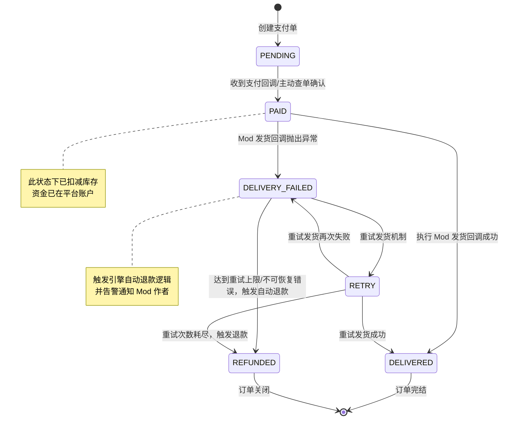

+++
date = '2026-06-18T14:16:00+08:00'
draft = false
title = 'Proxyos Weekly 069'
slug = 'proxyos-weekly-069'
series = ['proxyos-weekly']
categories = ['ProxyOS', 'DevLog']
tags = ['ProxyOS', '周报', '独立游戏开发', '技术日志']

+++

> TL;DR 概览
>
> 翻译机制确认无误，引入章、序章校对完成，支线任务系统规划完成待实现



# 本期目标

- [x] 用英语通玩一遍/至少跑到第一章（翻译机制全覆盖）
- [ ] 更多内容
  - [ ] 支线任务
    - [x] 确认方向
    - [x] 写功能需求
    - [ ] 实现
  - [ ] 更多任务
  - [ ] 实用化任务时限
  - [ ] 命令行内容？（等第三章？是否需要？）
  - [ ] 远程访问？
  - [ ] 更精细化管理事件而不是按章组织？
- [ ] 开个 itch
- [ ] 琢磨下宣传

# 进展速记

## 本期假设 / 预期

**预期：**

这期主要是通玩一次英文版，确定没有严重翻译问题

如果问题不多，这期内都解决了，那么开始设计支线任务。我得考虑下支线任务可以给什么奖励……因为主线任务的奖励就是新的剧情、看 npc 整新的幺蛾子，但支线任务没这优势。也许我需要参考《深空梦里人》那样加货币系统？那我需要考虑回收货币……

**结果：**

这期属实是爆肝了，因为换了 codex，再次不需要被 token 束手束脚、进入了疯狂 agent 模式，直接搞定了翻译内容的机制全覆盖测试和问题修复，还在其修改期间制定了支线任务系统的方向和需求

codex 的定价没 OpenRouter 的 api 那么抢钱，同时做两个平行线需求的规划、修改的情况下，plus 都基本够用。

而且在 copilot 不搞 request 计费而是搞 token 计费后，即使是 claude sonnet 4.6 也颇为昂贵。在金钱的压力下，gpt 5.5 也不是完全不能用，只是需要我十二分精力地仔细制定计划和检视……

## 本期确定性变化

### 新增：

- 

### 变更：

- 语言设置界面调整，使其真正跨语言
- 优化翻译流水线，使其基于 ast 处理 tres，以免遗漏字符串数组等非基础数据类型
- 延长导入章的静默时间到 15 秒，原本的 4 秒太短了，而再长会让玩家怀疑游戏出 bug 了
- 将注入的工具脚本也做 overlay，但只 overlay 对用户能看到的部分做翻译，其他部分用英文来减少校对压力
- 将序章的自删除动画彻底数据驱动，进度控制、错误提示等等控制都写在单一文本文件中，方便进行翻译
- 将关闭游戏的动作从自删除动画中剥离，以此保证事件动作的原子性
- 优化第一章 lesson 的数据结构，使 LessonConfig 引用代码脚本文件，而不是直接内联。这样可以保证编程语言解耦，如果以后要加其他语言的教程也好加

### 修复：

- 修复部分修改 Label text 导致翻译失效的 bug
- 修复因为 overlay 路径解析不支持目录，导致按目录隐式访问 index.html 的网站没有正确访问预期语言的 overlay
- 修复翻译 overlay 的生成中，html 的生成没有正确处理 xpath 导致该替换的文本没替换的 bug
- 修正翻译校对中遇到的各种不合适翻译
- 修复浏览器后退后无法前进的 bug……也不知道为啥我现在才发现
- 修复过滤器设置不合理，导致部分 json 被使用保底的 line code 方式翻译的 bug
- 修复序章的自删除动画播放过程中强退游戏导致进度卡死的 bug
- 修复 overlay 遗漏 LessonConfig 的 bug
- 修复翻译流水线没有替换 overlay 里的引用目标，导致英文资源内引用的外部资源还是中文资源的 bug
- 修复第一章第一节中途强退重启会导致时间在修复完成前就正常显示的 bug
- 修复第一章运行完成后不点提交、直接再次修改才提交的情况下按照上一次运行结果校验而非按最新内容校验的 bug

### 删除：

- 

# 主要进展内容/本期关键判断点

> 我做出了哪些「如果错了也要付代价」的判断？

## 语言设置界面调整

之前我没想清楚语言设置界面的错误提示应该怎么做（因为这个界面本质上是玩家开场时的语言设置界面，文本不管写哪国语言都不太合适），于是我临时写了段中文的占位

但现在这问题拖不下去了，我只能认真想想

我一开始想了两种方案：
- 使用 emoji、unicode 图形字符来跨语言
- 初始化语言时将其初始化为用户 os 的语言

但它们都有问题

前者确实是跨语言，但是 emoji 渲染差别很大，而 unicode 又不足以表述完整内容

后者本身就是矛盾的，因为这个语言设置界面本身就是因为无法信任`OS.get_locale()`才搞的

我不得不开始想第三种方案，所以我开始回忆有相似需求的其他操作系统模拟游戏是怎么做的。

结果我无奈地意识到我知道的操作系统模拟游戏都有开始菜单，它们把语言设置放开始菜单，完全不符合我希望尽可能提升沉浸感的需求……

于是我开始扩展寻找范围，不限于操作系统模拟，也不限于 steam 上架游戏，这时我第一个想到的就是 Fuyou 的 EP（E-Point） 系列——在最新作和开发中的这个最终作里，没有任何语言文本，一切都是图示和 UI 动效反馈（不得不说，近些年黄油的玩法创新经常比正经游戏靠谱）

所以结果就很简单了，加个画面抖动，然后用英文报错日志的方式显示必要 lore 就完事了——也不知道为啥我一开始竟然没想到

## 之前的预埋生效了，得意地叉腰。jpg

之前我就考虑了翻译问题，所以游戏里各种图示基本是用 svg 画的，现在它们都能走同一套流水线完成翻译，而不用搞图片编辑

## 之前的翻译 LLM（Qwen3.7-max）给我拉了坨大的

```csv
context,zh-CN,en-US,speaker,scene,confidence,notes,terms
json:/replyList[10]/content,>>>> 别好奇，我也好奇过，然后就看到一堆 @鸦鸦本循环吃什么 会喜欢的东西。,EN(id_003) :: >>>> 别好奇，我也好奇过，然后就看到一堆 @鸦鸦本循环吃什么 会喜欢的东西。  [terms: 循环],@💀,2_赛博道士。md/茶馆（proxy:%2F%2Ftea-talk.vibe）/帖子：天罗系列的防壁代理怎么样？,rag-single,, 循环
```

我是真的无法理解为啥翻译结果里会出现这种`EN(id_003) :: 全都是原文 [terms: 循环]`……

这已经不是注意力涣散了，这 tm 是突触熔毁了

## 翻译校对

| 原文                                                         | 机翻                                                         | 校对                                                         | 原因                                                         |
| ------------------------------------------------------------ | ------------------------------------------------------------ | ------------------------------------------------------------ | ------------------------------------------------------------ |
| 点击包含用户身体部分的图像来将图片和对应页面打包信息段，     | Click on the image containing the user's body part to pack the image and the corresponding page into a Data Segment, | Click on the image showing any part of the user to pack the image and the corresponding page into a Data Segment, | body part 会带来“用户已被分尸”的印象，这并非预期             |
| 获取至少包含用户 50%身体部分的影像资料                        | Obtain video material containing at least 50% of the user's body | Obtain visual data showing at least 50% of the user's body   | video material 会让玩家误解必须要视频                         |
| 按照需求 REQ-2847 的要求，严重违规的图像需要被彻底屏蔽，但是仍可通过一些手段看到。 | According to requirement REQ-2847, severely violating images need to be completely blocked, but they can still be viewed through certain means. | According to requirement REQ-2847, images flagged for severe violations need to be completely blocked, but they can still be viewed through certain means. | severely violating images 是什么鬼机翻                        |
| 在弹出的菜单中选择""检查"" <br/>在弹出的 DevTools 中高亮的元素上右键，选择""删除元素"" <br/>观察到图像区域的遮罩被移除，显示纯黑色背景 <br/>将附近的标签的'style'属性中的'display:none;'删除，然后按下 Enter 键确认修改 <br/>观察到显示出被屏蔽的图像内容 | Select ""Inspect"" from the pop-up menu<br/>Right-click on the highlighted element in the pop-up DevTools and select ""Delete element""<br/>Observe that the mask in the image area is removed, showing a pure black background<br/>Delete 'display:none;' from the 'style' attribute of the nearby  tag, then press Enter to confirm the modification<br/>Observe that the blocked image content is displayed | Select ""Inspect"" from the context menu <br/>Right-click on the highlighted element in the DevTools panel and select ""Delete element""<br/>Observe that the mask over the image area is removed, revealing a pure black background <br/>Remove 'display:none;' from the 'style' attribute of the nearby  tag, then press Enter to confirm the modification <br/>Observe that the blocked image content is now visible | pop-up menu 是什么鬼，中文用“弹出的菜单”是为了降低门槛，但是英文里 pop-up menu 和 context menu 可是俩东西 |
| 干不了是你能力不行，能力不行就滚蛋                           | if you can't do it, it's because you're incompetent, and if you're incompetent, get lost. | If you can't do it, you're incompetent. If you're incompetent, get lost. | 攻击性太弱                                                   |
| 这管理程序现在 T！M！D！没！人！知！道！在！哪！             | and right now T!M!D! N!O! O!N!E! K!N!O!W!S! W!H!E!R!E! this management program is! | and right now NOBODY FUCKING KNOWS WHERE this management software even is! | T!M!D! <br />FUCK THIS                                       |
| 用户脑机接口                                                 | User brain-computer interface                                | User BCI                                                     | BCI 应该更加流行，就像没人会叫 AI 为 artificial intelligence 一样 |
| 不要急，我正在深度思考……,                                    | Don't rush, I'm deep in thought...                           | Hold on, I'm deep-thinking...                                | 这本身是 deepseek 的梗                                         |
| 以下省略                                                     |                                                              |                                                              | 太 TM 多了                                                     |

## 翻译流水线优化

之前 txt、python、js 都走了 fallback，用 line code 当注入标记，但这属实不合适

于是改成了 txt 按段分割取 hash 做标记，python、js 用 ast path 做标记

## 提前寻思支线任务

目前这游戏设计有个问题：支线任务没有回馈

主线任务的奖励就是剧情，这个不是不可以接受，但是支线任务没有奖励的话就感觉纯 lintcode 了

而且这游戏的定位又不是 tis100 那种面向能从新编程范式本身获得乐趣的编程从业者的游戏，而是面向常规玩家的真实编程游戏，这就导致纯 lintcode 不可接受

### Citizen Sleeper 方案

一开始，我在考虑添加类似 Citizen Sleeper 的经济系统

但是仔细考虑后发现，如果和“稳定剂”一样定期收电费，那又和“何澈把整机搬走了”的叙事矛盾。即使用“何澈被琐事缠身没有机会交电费”的说法，玩家可能也会因为电费不得不在心里想着“妈的又要搬砖”的同时把注意力从主线上移开。我没信心能控制得和 Citizen Sleeper 一样精妙，使资源恰好够推动玩家行动又不至于真的让给玩家带来麻烦

### Hacknet 方案

然后我开始薅 Hacknet 的灵感，然后发现它几乎没有支线任务，其核心任务循环（见下方）实际上已经被本游戏的主线任务所参考了

- 收到邮件/任务
- 找入口
- 破解
- 找文件/改数据/删记录
- 回复任务
- 得到新线索/新节点/新工具
- 世界变大

而其少数的支线任务“Entropy 合约”（本质上是主线任务某个阶段里的 N 里选 M 个做）也很难参考，因为 Hacknet 本身是命令行为主的，其内容很自然地大多是纯文本文件；但是这个游戏是在假装有个真实网络，我可以加一些无关紧要的随意实现的页面，但是如果将其作为任务奖励的一部分，那就必须要与主线有机协作——但是主线任务的设计本质上是一个循序渐进的编程实践教程，支线任务和主线强耦合就会导致支线任务设计难度直线上升

而如果使用经济系统，就能合理地“从玄云观买插件/硬件增强”，也能设计更通用的解谜，一些“玩家在开始接下来的任务前最好进行巩固”的知识点也能混进去。

### ProxyOS 方案

于是我意识到，我确实需要经济系统，但不该把经济系统作为生存压力，而是作为任务市场 + 通用奖励兑换层。如此两难自解。

- 从玄云观任务板等位置接支线任务
- 获得不记名信用点
- 使用信用点
  - 购买插件（如主线任务要求）
  - 代理额度（某些高危任务每次提交都要花费金额来做一次性代理）
  - 自动测试工具（控制节点为了保证可靠性不能透露测试集，但是不禁止计算节点使用自动测试集生成工具进行测试与问题发现）
  - 仿生逻辑块（预包装的工具类，但不能直接解决问题，只是减少样板代码，让后续任务更顺）
  - 奇怪小玩具

## 制定支线任务框架

我准备让支线任务可以通过`pocket://`链接导入，复用第三章叙事“Laurence042 假装发防壁给玩家，实际上是借此往玩家任务管理器里插了个任务，向玩家提供了 ghostine 的新线索”的同时，也让 mod 制作更加简单

我原本的计划是这样的

- 任务系统
  - pocket
    - 完善 pocket 内的 link handler，使其支持通过`pocket://task/add?content=...`之类的的任务 JSON 序列化字符串链接创建 requirement 全部为 remote request 的任务，并能把任务保存进存档（如 importedTaskDefinitions），但不能和内置任务 id 重叠，建议使用下划线分割的 camelCase 的`modId_任务创建者_任务链主题_任务名`的格式，比如`core_dev_sector7b_decodeLog`。目前将游戏内置内容视为名为“core”的 mod，后续支持 mod 后这个 modId 前缀也能避免 mod 开发者的任务和其他人冲突
    - 新增 remote request 类型的 requirement（包含校验逻辑以及校验成功后的信用点链接 `wallet://`）
    - 让 TaskDefinition 可以序列化、反序列化 json
    - 不需要考虑`pocket://`导入来源，玩家可以自己写`pocket://`导入任务，但因为 requirement 全部为 remote request，奖励只能由玩家无法接触的后端处理，所以不存在滥用问题或者不可控系统级副作用问题

但它有非常严重的问题——序列化的任务无法做 i18n。

不管是放 key（需要额外翻译文件，制作成本高，而且和目前的 overlay 路线完全不搭），还是固定玩家当时的语言（包含所有语言的话过于臃肿也不符合叙事，单独对应语言也需要大幅定制翻译流水线，让翻译 llm 能理解哪里需要翻译、哪里不能动、哪里需要转义）都有不可接受的弊端

我想了个方案，但我没有直接更新，而是把这个旧方案给 codex 检视

我把这个缺陷作为 mm 豆来确定 codex 的能力

结果其不出所料地歇菜了

其中的 mm 豆是“序列化的任务导入很难处理 i18n”，结果它都提出“导入任务后切换语言重新载入对应语言的 overlay 任务包时，不能把这种外部导入的任务清掉”了，还是没意识到这问题

甚至当我把这件事重新讲给 codex，让其给个新方案，其还建议我结合放 key（可翻译任务）和固定语言（不可翻译任务）……绝了

唉，所以说架构还是得人类想啊……所以我还没彻底失业

我的新方案如下：

- 任务系统
  - pocket
    - 完善 pocket 内的 link handler，使其支持 `pocket://task/add?source=...`。`source` 是 URL Encode 后的 `proxy://` 后端 API 地址；玩家点击链接后，由 Pocket 向对应的 Mod Python 后端发送任务领取请求
    - 任务定义由 core 或已安装的 Mod 预先提供并注册，继续使用现有 `.tres` 与 i18n overlay，不在 Pocket 链接中序列化任务定义。Python 后端通过可信 IPC 请求 Godot 解锁并发放已注册任务，Godot 只接受该后端所属 Mod 命名空间内的任务 ID
    - IPC 发放操作需要幂等，重复点击链接只能返回任务已经领取，不能重置任务进度或重复发放。由后端触发的任务需要和依赖满足后自动激活的内置任务区分，避免 `scan_and_activate_tasks()` 提前发放
    - 任务 ID 建议使用下划线分隔的 `modId_任务创建者_任务链主题_任务名` 格式，分段内部使用 camelCase，例如 `core_dev_sector7b_decodeLog`。目前将游戏内置内容视为名为 `core` 的 Mod；后续由 Mod 加载器确定并注入 `modId`
    - 新增 remote request 类型的 requirement（包含校验逻辑以及校验成功后的信用点链接 `wallet://`）

通过这种方式，既保证了叙事一致性，又让整个架构明晰，导入的任务仍然走通用的任务系统，翻译流水线也不用改一点

但你也许注意到了`python 后端`这个描述，这就是另一个故事了……

## 制定付款系统框架

如前文所说，我需要引入信用点机制，但这带来了新的问题：

这是个鼓励玩家到处看源码、到处折腾游戏里 npc 网站的游戏

所以这个信用点机制必须要看起来足够真实，而且要有足够的扩展性

于是……我决定一步到位——直接上之前准备的 mod 机制，走真实 python 后端，搓真实付款系统

- 信用点系统
  - wallet
    - wallet 架构上是一个 app，但没有自己的 activity bar entry
    - 调整 ControlPanel UI 保证可读性
    - 在存档文件里用类似`[{"denomination":10,"serial":"A1...","issuer":"CPG","signature":"..."},...]`的内容来记录发的币
      - `signature`为`version || issuer || key_id || denomination || serial`utf-8 编码的 Ed25519 非对称签名。其中 key_id 设定上是发行者轮换密钥的结果，但实际上因为游戏内预期不会发生轮换，只要数值别太离谱就行，可以一直用一个。玩家能用存档投影里的公钥校验（后续可以给个支线任务，对方私下交易给假币/私发冷门币），但不能自行伪造。serial 应按发行方组成唯一键，不过直接用 UUID 应该也没啥问题
      - 消耗时自动移除对应一系列条目并找零（发新币），先最小化投入金额，再最小化付款后币数。
      - credit 只展示 CPG 币，鼠标悬停可以展示其他组织的私有币（比如完成玄云观的外部任务会给 CPG 币，完成内部任务会给玄云观贡献点）
      - CPG 币的面额和购买力参考 RMB，玄云观贡献点同样，其他组织的商品往往 CPG 币价格和玄云观贡献点价格一样，但是通常来说玄云观贡献点在玄云观内购买力稍大于 CPG 币（10CPG 币的商品可以用 8 玄云观贡献点买），而且能买一些独占商品（如仅限一个的货运平台）。
      - 花费时如商品无特殊配置都是只接受 CPG 币
        - 玄云观同时接受 CPG 币和玄云观贡献，但有些商品，比如货运平台只能用玄云观贡献买
        - 同时只能用一种币结算，不能混用（表现上就是点购买后弹出下拉选单选结算币种）
        - 币种之间默认无兑换汇率，但有些组织以商品形式提供兑换，而且通常是往 CPG 币单向兑换
      - 设定上发币组织会在 CPG 上注册自己的公钥供其他组织收币时验证，实现时其实就是 godot 里 tres 写各个组织的配置。（后续可以给个支线任务，玩家可以自己私发币，然后设法通过漏洞把自己的公钥写到目标组织自己搓的交易组件里，让其接受自己的私发币来买正常打工不可能买得起的东西）
      - 注意双花问题，存档中需要记录 spent_serials 集合（`{issuer:{serial,serial,...}}`），且不应将 spent_serials 集合投影
      - 收款时同时检查签名、serial 未持有、serial 未花费。
      - 找零必须生成全新 serial。
    - 每次更新时（启动游戏、付款、收款）重读投影文件，如果投影文件不合法就使用内存里的计算后写入原始存档和投影，如果投影文件合法但部分条目不合法（sign 不对）就以投影文件里合法的部分为准计算后写入原始存档和投影（让试图作死还没备份条目的玩家少钱，让后期确认了 sign 私钥的玩家能随意印钱）。文件部分不合法或整个文件不合法（不论是 json 语法还是 sign 不对），弹出通知提示“已丢弃非法信用币”一类的内容
      - 玩家自己删掉合法币条目视为遗失，但不视为花费（不加入 spent_serials），玩家恢复后可以正常花费
      - 玩家自己备份的旧投影里已被花掉的币会被 spent_serials 拦住，并在加载时直接更新删除，弹出通知提示“已丢弃非法信用币”一类的内容
      - “投影部分损坏的修复”与付款必须在同一事务中完成，避免修复落盘成功但付款失败，或反过来。具体付款流程说明见下方“实现”一节
    - 印钱并生成信用点转入链接 `wallet://claim?xxx=...`，handle 信用点收入链接时往存档写入，用于通过任务给报酬的场景。虽然可以直接调 godot 类，但是我倾向于做戏做全套，而且入口越少越不容易被滥用
    - 接受信用点转出链接 `wallet://pay?xxx=...`，handle 信用点支出链接时往存档写入，并向发出者反馈收款成功或者余额不足
- 付款系统
  - 添加一个 SPIDER 组件，用于处理支付。需要注意易用性和安全性，类似`await pay("CPG", 50).then((ticket)=>send_update(ticket,payload)).error(xxx)`
    - 防止通过公开游戏 API 误刷和重放
    - 安全性和可靠性通过后端 python 和 godot 的协作机制来保证
  - 为玄云观页面添加一个旧通用平台的商品
    - 购买后解锁货运平台 app，后续实体任务道具都视为存放在这个通用平台上
    - 货运平台 app 还可以遥控货运平台在空间站上的移动

### 实现

做戏就做全套，下方`python 侧`如无特殊说明，默认是指`proxy_os_ipc`里提供的公共逻辑

相关的防重放、重复付款操作参考现实流程的对应处理

| 现实标准流程                                                 | 对应实现                                                     | 备注                                                         |
| ------------------------------------------------------------ | ------------------------------------------------------------ | ------------------------------------------------------------ |
| 电商前端向电商后端提交支付请求（携带业务订单号 OrderID)       | （游戏启动时：godot 会在游戏启动后启动框架 python 并根据其通过 ipc 传来的 url 列表来注册 url、初始化库存、加载库存存档）<br />webview 侧：发请求到 godot 电商接口<br />godot 侧：根据注册的电商接口给 python 侧发 ipc | 电商接口的实现参考下方的“通用后端注册机制”                   |
| 电商后端校验订单状态/金额，生成内部支付单 (PayID)            | python 侧：如果存货不足返回。如果货源充足，用商品 id 得到绑定 merchant_id、sku、payload_hash、接受的币种及对应价格、nonce、expiry 信息的 signed invoice |                                                              |
| 电商后端向支付宝请求预下单 （调用 alipay.trade.app/pay/precreate 接口） | 无                                                           | 我们没必要真实现三方隔离                                     |
| 支付宝向电商后端返回支付宝交易号 (trade_no) 及拉起支付所需的签名参数串 | 无                                                           |                                                              |
| 电商后端向电商前端返回拉起支付宝的签名参数                   | python 侧：经由 godot 的 ipc，把 signed invoice 发给 webview 侧      |                                                              |
| 电商前端利用参数唤起支付宝收银台/APP                         | 无                                                           |                                                              |
| 用户输入支付密码，完成指纹/面容核身                          | webview 侧：发 signed invoice 给 godot cpg 接口<br />godot 侧：（原子）wallet 处理扣款，记录 signed invoice 进存档 |                                                              |
| 支付宝向电商前端同步返回支付结果 （前端展示"支付成功", 但此状态不可信） | 无                                                           | 没必要凭空引入复杂度                                         |
| 支付宝向电商后端异步回调通知 (POST 到预设的 notify_url)      | godot 侧：ipc 通知 python 侧交易完成                            | 如果在上一步 godot 扣款完成和下一步 godot 发货完成之间强退了，下次启动时可以用存档里的 signed invoice 通知 python 侧处理继续处理 |
| 电商后端 1. 验签 2. 幂等校验 3. 金额校验 4. 更新订单为已支付 | python 侧：通知 godot 更新库存、玩家物品（发货）<br />godot 侧：（原子）发货并失效 signed invoice |                                                              |
| 电商后端向支付宝返回字符串 "success" （告知支付宝已收到通知，停止重试） | 无                                                           | 通知 godot 本身就相当于 success                                 |
| 电商前端向电商后端发起支付结果轮询查询 （携带 OrderID/PayID)  | webview 侧：发请求到 godot 电商接口                             |                                                              |
| 电商后端向电商前端返回最新订单状态 （已支付）                  | python 侧：通知 webview 侧完成                                  |                                                              |
| 电商前端跳转至"支付成功"结果页，触发后续业务（如请求发货）     | webview 侧：数据变更                                          |                                                              |

### 通用后端注册机制

目标是使用 python 作为后端，来便捷地扩展游戏内的网络生态，也更有利于 mod 开发。这就需要一个灵活、去中心化的注册机制。

其实现包含一个框架和可扩展的处理脚本。框架需要封装 pluggy 为合适的方式，使扩展脚本可以使用类似下面的写法实现扩展逻辑（命名可以更贴近世界观一些，比如不要用 player）

```python
# some_mod/shop.py  ——  mod 作者只需要写这些

from proxy_os_ipc.cpg.server.merchant import item, ShopRequest

@item("cybertaoism.team/grocery/apple", price=0.99, title="红富士苹果")
def sell_apple(req: ShopRequest):
    # 到这里，钱已经扣完了，绝对安全
    req.player.inventory.add("apple", count=1)
    return {"msg": "你买了一个红富士"}

@item("cybertaoism.team/grocery/sword", price=6.00, title="铁剑", stock=10)
def sell_sword(req: ShopRequest):
    # stock=10 → 框架自动做库存扣减，mod 作者不用管
    req.player.inventory.add("iron_sword", count=1)
    req.player.send_message("你获得了一把铁剑")
    return {"msg": "铁剑已放入背包"}

# 批量注册也行
@item("cybertaoism.team/grocery/bundle", price=19.9, title="水果大礼包")
def sell_bundle(req: ShopRequest):
    # req.paid_amount 保证是 19.9
    # req.payment_id 是唯一的支付流水号
    for fruit in ["apple", "banana", "orange"]:
        req.player.inventory.add(fruit, count=3)
    return {"msg": "大礼包已发放"}

```

如果需要新货币（如玄云观贡献点）

```python
from proxy_os_ipc.cpg.server.credit import credit

credit.create_new_type("veiled_nimbus_contribution")
```

扩展脚本需要可以使用 pip install 来管理依赖，每个后端处理脚本都在`pyproject.toml` 里声明依赖，框架通过 entry points 加载入口。这样以后加了 mod 也可以直接 pip install 处理

i18n 由插件实现者自行处理，推荐使用 python 自己的 gettext

> 虽然这会导致 mod 作者需要同时处理两套翻译机制，用游戏里提供的 translation/tools 生成 html overly、使用 gettext 处理 python 后端，但这是不得已的
> 
> 因为 html 绝对不能走标准 i18n，否则整个风格就垮掉了（虽然 mod 作者不在意这个的话也可以让 html 走标准 i18n 就是了……）
> 
> 而我不能保证这冗杂的奇奇怪怪后端实现都能被 translation/tools 正常处理

后续现有的使用 godot 实现的接口也会逐渐迁移到这个机制上

merchant 实现需要注意：

- 安装的 Mod 后端属于可信代码，恶意 Mod 不在防护范围内；
- 玩家工作区脚本属于不可信代码，不能注册商户或调用发货 IPC；
- IPC 需要区分框架进程与玩家脚本；（`proxy_os_ipc.cpg.server`只提供给 mod 作者，玩家工作区里的 proxy_os_ipc 没有这个模块）
- Godot 只接受绑定 payment_id + merchant_id + sku 的一次性发货能力或经过校验的命令批次。
- 金额必须全程使用整数



# 瓶颈与问题清单

> 哪些问题还没解，但也许我已经知道“它们不是什么”？

我属实不太确定明天我会不会扇自己巴掌，一边扇一边反思自己为啥要在能让玩家各种瞎折腾的游戏里做交易系统

# 下期计划

- [ ] 支线任务支持
  - [ ] 任务系统更新
  - [ ] 制作支付系统
- [ ] 更多内容
  - [ ] 支线任务
  - [ ] 更多任务
  - [ ] 实用化任务时限
  - [ ] 命令行内容？（等第三章？是否需要？）
  - [ ] 远程访问？
  - [ ] 更精细化管理事件而不是按章组织？
- [ ] 用英语通玩一遍
- [ ] 开个 itch
- [ ] 琢磨下宣传

# 试玩版

暂缓，第一次上传需要做好准备，等进入 beta 阶段再说