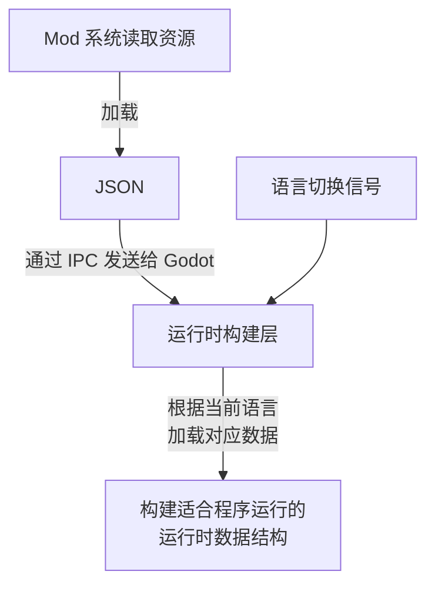

+++
date = '2026-07-09T19:35:00+08:00'
draft = false
title = 'Proxyos Weekly 075'
slug = 'proxyos-weekly-075'
series = ['proxyos-weekly']
categories = ['ProxyOS', 'DevLog']
tags = ['ProxyOS', '周报', '独立游戏开发', '技术日志']

+++

> TL;DR 概览
>
> 基本完成了迁移，一些细碎问题留下期处理



# 本期目标

- [x] 迁移现有内容中适合 mod 化的部分（基本是完整第二章）
  - [x] 任务、剧本、桌宠等资源
- [ ] 将第三章开头补充进 demo
  - [ ] 调整第二章末尾文本，引入经济系统和支线任务系统
  - [ ] 通过经济系统获得通用搭载平台
  - [ ] 将 demo 结束提示放在通用搭载平台的 app 里
- [ ] 更多内容
  - [ ] 支线任务
  - [ ] 更多任务
  - [ ] 实用化任务时限
  - [ ] 命令行内容？（等第三章？是否需要？）
  - [ ] 远程访问？
  - [ ] 更精细化管理事件而不是按章组织？mod 支持？
- [ ] 用英语通玩一遍
- [ ] 开个 itch
- [ ] 琢磨下宣传

# 进展速记

## 本期假设 / 预期

**预期：**

tmd 说啥也得把迁移做完了，下期把迁移产生的问题修了，下下期搞定第三章的基础设施，要不然就得干一年 demo 还没出来了

**结果：**

大部分迁移完了，但是路径处理有点尾巴得下周才能处理了

## 本期确定性变化

### 新增：

- 给 godot-wry 添加对 res://响应的 http header 内容获取支持，使 godot 侧在加载 res://提供的网页时能知道其 header 里的 http status、content-type 等内容
- 给浏览器提供下载功能。当访问的并非 html 时，就触发下载，将文件通过 CopyFileAction 复制到玩家工作目录，并通过 NoftificationAction 添加下载提示，而非像之前那样在 frontend 和 Workspace 里搞一堆同名文件
- 提供了基于 WebView 的应用界面框架

### 变更：

- 迁移 cybertaoism 和 teatalk 的前后端为 mod 模式
- 调整 translations\tools 使其适用于 mod 环境
- 优化玩家工作区管理器，使其支持 mod 间覆盖文件
- 调整 mod 加载架构，使其使用注册模式来避免每次加模块都在主加载器的数据模型里加东西
- 将原本在 game_content 和旧非打包目录的 proxied.from.unknown.architecture 中的游戏内容全量迁移为 mod 实现，前者成为空目录被删除，后者目前只承载 python runtime 被重命名为 static_asset
- 优化 releas build 流程，不用再手配内嵌 npm 项目的 dist 和 npm run build 了
- 优化 mod 配置里的文件引用/路径处理，简化了 Mod 作者的工作，并让整体数据架构更加明晰
- 将之前的一些演出临时界面切换为 SpiderView 实现，并优化了其中审计部的应用样式——不得不说还是 html+css 做样式方便还精致

### 修复：

- 修正玩家的 vscode 配置使其适配新架构

### 删除：

- 

# 主要进展内容/本期关键判断点

> 我做出了哪些「如果错了也要付代价」的判断？

## 翻译，又是翻译

在完成数据迁移后，我检查了变更边界，开始进行兜底分析：哪些少了（需要检查对应的陈年逻辑是否已经消除）、哪些变了（需要检查对应逻辑是否通顺）、哪些多了（需要考虑新的边界、限制）

然后我意识到迁移前没真正分析清楚的东西——翻译

因为迁移后，打包进 pck 的 tres 数据都改成了 Mods 里不打包的 json。显然需要重新决策之前的 overlay 模式翻译是否合适了

### 分析现状

因为大量使用了 json 配置，因此几乎所有本地化都需要围绕 json 进行。

主流的 gettext 方案需要在 json 里写一堆 id，然后翻译人员也会因为比对麻烦而倾向于不看 json 只看 po 进行盲翻，这既不利于效率也不利于质量

最初决策时我在 json 里使用`{attr:val, "attr:lang":translated_val}`的方式提供对应语言的“后缀键”

其实这本来不是一拍脑袋的结果

因为我考虑过`{attr:{zh:val, en:val_en}}`的“嵌套值”模式，其信息角度上说和变种属性模式没有本质差异，而后续升级空间较大（可以调整可翻译键的数据结构，不只是单纯的 lang:text，还可以把 text 部分改成包含文字方向的结构来支持阿拉伯语之类的从右往左写的语言），但写起来明显更麻烦

我也考虑过 overlay 模式，但这个项目是高度数据驱动的，它有一个负责核心逻辑的 godot 程序和负责外围数据和自定义逻辑的 mod 系统。godot 会在启动时要求 mod 系统加载数据，并通过 ipc 发给自己。如果使用嵌入式模式，只需要在统一加载时让 godot 各个组件缓存加载的人类可读 json，自行将其加载为适合程序运行的运行时数据结构，更换语言时只需要广播一个信号，让其自行重写加载即可。但是如果使用 overlay 模式，那么就需要让 godot 重新启动 mod 系统的数据加载流程。

但为什么它又成了问题呢？因为我突然意识到，我并不确定这个是统一加载的问题，还是 overlay 本身的问题

### 方案比较

#### 方案 A：`{attr:val, "attr:lang":translated_val}`（后缀键）

```json
{ "title": "Hello", "title:zh": "你好" }
```

- 优点：
  - 默认值和翻译在同一层，读取时 fallback 简单（找不到 `title:zh` 就用 `title`）。
  - 默认值和翻译在相同文件，翻译者不会搞出奇怪的编码
- 缺点：
  - 键名污染严重。程序要处理"哪些是内容键、哪些是语言变种键"的解析逻辑，schema 校验变复杂。属性一多，同一层级键数量爆炸。
  - 更复杂结构处理麻烦。字符串数组怎么做？带字符串的对象的数组怎么做？
  - 翻译 pr 会频繁变更文件导致难以追踪是数据改了还是只改了语言

#### 方案 B：`{attr:{zh:val, en:val}}`（嵌套值）

```json
{ "title": { "en": "Hello", "zh": "你好" } }
```

- 优点
  - 默认值和翻译在相同文件，翻译者不会搞出奇怪的编码
  - 避免在解释层硬编码语言和文字顺序，它可以通过扩展`lang:text`的 text 为更复杂的对象来提供更精细的翻译
- 缺点：
  - 污染了值的结构。程序里每个可翻译字段都要判断"这是普通值还是语言字典"，无法用统一 schema 描述。如果某字段有时翻译有时不翻译，处理更乱。
  - 更复杂结构处理麻烦。而且如果 `attr` 本身的值可能就是一个对象（比如 `title` 是个结构体），语义会冲突。只能在最底层的字符串上做，而这会导致编写繁琐
  - 翻译 pr 会频繁变更文件导致难以追踪是数据改了还是只改了语言

#### 方案 C：字段级不动，翻译独立成 overlay

```json
// base
{ "title": "Hello", "code": 3 }
// zh.overlay
{ "title": "你好" }
```

- 优点：
  - base 结构干净，翻译文件结构与 base 同构，翻译人员可以对照 base 结构翻译（一定程度上消减"盲翻"痛点），schema 不受污染。
  - 可以自行决定翻译 overlay 粒度，决定覆盖一级对象节点还是只覆盖叶子字符串节点
  - 原始文件和翻译分成不同文件，更方便进行 pr 管理
- 缺点：
  - 需要一套 path 定位机制（哪些字段可翻译、怎么对应）。
  - 仍然需要翻译人员对照着 base 看，不能一个文件搞定
  - 默认值和翻译在不同文件，某些翻译者可能使用他们自己国家常用的编码而非 UTF-8，进而带来额外成本

#### 或者放一起

| 对比维度                      | 方案 A：后缀键                                 | 方案 B：嵌套值                                     | 方案 C：独立 Overlay                                                                                                                  |
| ------------------------- | ---------------------------------------- | -------------------------------------------- | -------------------------------------------------------------------------------------------------------------------------------- |
| 示例                        | `{ "title": "Hello", "title:zh": "你好" }` | `{ "title": { "en": "Hello", "zh": "你好" } }` | Base：`{ "title": "Hello" }`<br>Overlay：`{ "title": "你好" }`                                                                       |
| 基本思路                      | 在原字段旁增加带语言后缀的变种字段                        | 将字段值替换为“语言 → 内容”的字典                          | 保持原始数据不变，在独立文件中覆盖可翻译字段                                                                                                           |
| Base 数据可读性                | 较差。翻译数量增加后，同层键数量迅速膨胀                     | 一般。键结构干净，但字段值被本地化结构包裹                        | 最好。Base 始终保持纯粹的业务数据结构                                                                                                            |
| Schema 影响                 | 严重。需要区分普通键和语言变种键，校验规则复杂                  | 严重。字段类型由字符串变成语言字典，难以使用统一 schema              | 较小。Base schema 不受影响，Overlay 可单独定义规则                                                                                              |
| 读取与 Fallback              | 简单。优先读取 `title:zh`，不存在时读取 `title`        | 较简单。按当前语言取值，不存在时读取默认语言                       | 需要先加载 Base，再应用当前语言的 Overlay                                                                                                      |
| 可翻译字段识别                   | 依赖键名后缀规则                                 | 依赖字段值是否符合语言字典结构                              | 依赖 Overlay 路径或可翻译字段声明                                                                                                            |
| 简单字符串支持                   | 良好                                       | 良好                                           | 良好                                                                                                                               |
| 字符串数组支持                   | 较差。难以清晰表达整个数组或单个元素的翻译                    | 较差。需要决定语言层位于数组外还是字符串叶子节点                     | 较好。可选择覆盖整个数组，也可覆盖具体元素                                                                                                            |
| 嵌套对象支持                    | 较差。语言后缀容易扩散到大量叶子字段                       | 较差。语言字典可能和业务对象本身产生语义冲突                       | 较好。Overlay 可以与 Base 保持同构，并按路径递归覆盖                                                                                                |
| 复杂结构扩展性                   | 较差。基本绑定于“语言后缀键”模型                        | 较好。语言对应的值可以从字符串扩展为包含文字方向等元数据的对象              | 较好。可以扩展 Overlay 节点格式或加入元数据，但需要额外规范                                                                                               |
| 翻译上下文                     | 较好。原文和译文位于相邻位置                           | 较好。不同语言集中在同一字段内                              | 一般。译文与 Base 分离，但文件结构同构，可通过工具并排展示                                                                                                 |
| 翻译文件操作体验                  | 简单，无需跨文件查看                               | 简单，无需跨文件查看                                   | 需要同时查看 Base 和 Overlay；最好提供专用编辑或对照工具                                                                                              |
| 编码一致性                     | 较好。翻译直接进入原 JSON，通常会沿用项目编码                | 较好。翻译直接进入原 JSON，通常会沿用项目编码                    | 存在额外风险。独立翻译文件可能使用非 UTF-8 编码，需要导入校验                                                                                               |
| Git / PR 可追踪性             | 较差。业务数据变更与翻译变更混在同一文件中                    | 较差。业务数据变更与翻译变更混在同一文件中                        | 最好。业务数据和各语言翻译可以分别审查、合并和回滚                                                                                                        |
| 多语言扩展后的体积                 | 同层键数量随语言数线性增长，可读性快速下降                    | 单字段内部语言数量增长，结构尚可，但整个 Base 文件持续膨胀             | Base 大小不变，每种语言独立增长，拆分和按需加载更容易                                                                                                    |
| Mod 作者负担                  | 较低。只维护单个文件                               | 中等。必须按照本地化字段结构编写数据                           | 中等。需要维护 Base 与对应的 Overlay 路径关系                                                                                                   |
| 翻译者误改业务数据风险               | 较高。翻译和业务字段位于同一文件                         | 较高。翻译和业务字段位于同一文件                             | 较低。翻译 PR 原则上只接触 Overlay 文件                                                                                                       |
| 加载复杂度                     | 低。读取字段时进行语言键选择                           | 低至中。读取可翻译字段时解析语言字典                           | 中至高。需要查找 Overlay、递归合并并处理缺失路径                                                                                                     |
| 运行时语言切换                   | 容易。缓存原始 JSON 后重新解析即可                     | 容易。缓存原始 JSON 后重新解析即可                         | 如果原样传递给 godot，缓存原始 JSON 后重新解析即可；如果 Mod 侧只传对应语言解析后版本，则需要重新启动 Mod 系统                                                                  |
| 主要风险                      | 键名污染、schema 复杂、复杂结构表达能力弱                 | 值类型污染、业务对象与语言对象语义冲突、叶子字段编写繁琐                 | Mod 加载后通讯架构、路径匹配、数组合并语义、孤儿翻译、编码校验以及 Overlay 合并规则复杂                                                                                           |
| 主要优势                      | 实现最直接，Fallback 极其简单                      | 本地化信息集中，未来可承载文字方向等语言元数据                      | 业务数据与翻译彻底分离，结构干净，适合大量数据、多个 Mod 和独立翻译 PR                                                                                          |
| 更适合的场景                    | 小型配置、语言数量少、字段主要是简单字符串                    | 数据结构较简单，且需要为语言值附加额外元数据                       | 高度数据驱动、配置规模较大、复杂嵌套较多、翻译需要独立维护的项目                                                                                                 |
| 总体评价                      | 最直观，但规模扩大后技术债增长最快，能力也相对受限                     | 结构比后缀键规整，但会侵入所有可翻译字段的数据类型                    | 翻译盲翻问题只是消减而非像其他两个方案那样彻底清除。但长期边界最清晰                                                                                               |

### 方案决策

其实仔细来看，只要让 Godot 侧持有原始 json，那么三个方案应该都能热切换语言

而目前的核心分工为



overlay 模式相比于其他两个，无非是 JSON 格式不同，但本质上还是作为一个 JSON 对象发给 Godot 的，Godot 仍然能将其作为一个 JSON 对象进行合并，本质上只是语言属性选取改成了 overlay 合并

因此 overlay 的主要额外成本并非加载更复杂，而是取最终运行时数据更复杂——这可以通过工程解决

那么在没有奇葩工期和绩效限制的情况下，overlay 应该才是最好的模式

因此需要把 mod 系统的后缀翻译模式改成 overlay 模式，核心概念变更为
- 将 A.lang.B 视为 A.B 的语言 overlay，mod 系统加载时以 {base: base_json, overlay:{en:en_overlay_json}}的格式将数据原封不动发给 godot 侧，godot 侧处理合并。约定避免 weapons.sword.legendary.json 这种文件名，需要逻辑分组的时候用目录分组。确实需要的情况下以第一个分隔符后的所有内容为后缀，比如 A.tar.gz 的英语版本是 A.en.tar.gz
- 给 I18nOverlay 添加一个按语言将 {base: base_json, overlay:{en:en_overlay_json}} 合并为 overlayed_base_json 并返回的方法。各个组件自行缓存自己从 framework_raedy 事件里收到的 payload，并调用 I18nOverlay 的方法将其合并为需要用的 overlayed_base_json ，后续 json 处理逻辑可以保持不变。接到修改语言信号时，再次调用 I18nOverlay 的方法进行合并，然后再次重新加载数据
- I18nOverlay 的合并算法是递归下降，对象逐 key 合并，overlay 有的覆盖，没有的保留 base。数组情况按索引合并
- 翻译流水线暂时不动，它的修改太多，已经过于臃肿了，在本次调整后我们会专门排个计划来处理翻译流水线

### 存储格式

我在考虑要不要切换为类似 JSONL 的存储格式，用来替换转义经常出现灾难的 csv。

虽然 claude opus 建议我切，因为 csv 不仅转义灾难，而且数据结构比较受限。但我想了想还是决定继续用 csv。

因为这个翻译流水线是和 llm 高度绑定的，并不需要人去用 excel 编辑 csv，也就没兼容问题了。

而即使需要人来编辑，实际上直接用 vs code 也行，毕竟基本只有文本文件和 html comment 场景会出现一段文本多行还没有自带`\n`之类转义的情况，但这些文本通常不太容易大量出现双引号，使用双引号包围 csv cell 即可。

而 csv 确实看起来更方便，也不需要太专门的软件。

## 关于任务需求是否归一

我在考虑是否将目前的任务需求的三个变种，也就是数据段、脚本验证、远程请求，统一为远程请求。

因为本质上远程请求能力上是覆盖了前两者的。

但寻思了一下感觉好像暂时没必要，因为他们设定上都是控制节点发的内部任务，迁移成远程请求实现反而不符合 lore

而且我属实不太想继续折腾更多 bug 了……

## Fuck Codex

Codex 似乎很擅长修问题、实现新功能，但不擅长重构。如果我想为了调整数据流做前置准备，并要求它使用一个和当前架构不是很搭但能用、在新的架构里会很高效的算法时，它会自己寻思一套更符合当前数据流的算法——本质上是服从度不行，不信任用户能力。

但我属实不觉得我的能力比程序员能力中位数高多少……

所以 OpenAI 也许更倾向于让 Codex 通过寻思为那些不擅长提需求、不确定自己工程路线的没那么专业的用户优化需求，而不是倾向于避免让 Codex 的寻思拖稍微专业的点的用户的后腿。

# 瓶颈与问题清单

> 哪些问题还没解，但也许我已经知道“它们不是什么”？

- 多 mod 共同提供同一域名会让路径解析、overlay、404 fallback、历史记录之间的关系变复杂，不确定当前 basic browser / basic webview / web browser app 的职责边界是否已经是最佳的。
  - 已优化，在实现 SpiderView 的过程中，web browser app 里的路由、脚本注入等相关功能被抽取到了 SpiderManager，WebBrowserManger 现在单纯处理历史记录、书签之类的

- mod meta、mod list、pylock.toml、依赖安装与版本回滚之间还需要形成稳定流程，否则后续 mod 管理会变成新的技术债。

# 下期计划

- [ ] 修 bug
  - [ ] i18n 更新
  - [ ] mod 系统冒烟
  - [ ] mod 数据加载
    - [ ] 常规数据扫描
    - [ ] 网页 route
  - [ ] 基于 SpiderView 的 mod 自定义 AppView 冒烟
  - [ ] 文件引用处理冒烟
- [ ] 将第三章开头补充进 demo
  - [ ] 调整第二章末尾文本，引入经济系统和支线任务系统
  - [ ] 通过经济系统获得通用搭载平台
  - [ ] 将 demo 结束提示放在通用搭载平台的 app 里（SpiderView 实现）
- [ ] 更多内容
  - [ ] 支线任务
  - [ ] 更多任务
  - [ ] 实用化任务时限
  - [ ] 命令行内容？（等第三章？是否需要？）
  - [ ] 远程访问？
  - [ ] 更精细化管理事件而不是按章组织？mod 支持？
- [ ] 用英语通玩一遍
- [ ] 开个 itch
- [ ] 琢磨下宣传

# 试玩版

暂缓，第一次上传需要做好准备，等进入 beta 阶段再说